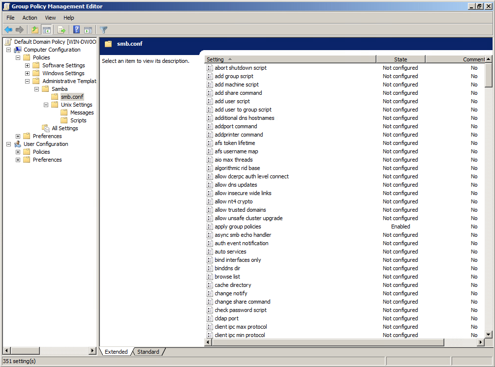

# Introduction {#intro}

```{r, echo=FALSE, out.width="30%", fig.align='center'}

```

Starting with version 4.14, Samba has included support for applying Group Policy objects (GPOs) to Linux clients, making it possible to use Group Policy to centrally manage and configure Linux systems in a Windows environment.

Samba's Group Policy support is designed to be similar to what is offered by proprietary tools, such as Vintela's and Centrify's Group Policy solutions. This allows Linux users to take advantage of the same powerful Group Policy features that are available to Windows users, without having to rely on proprietary tools.

Overall, Samba's Group Policy support makes it possible for Linux users to manage and configure their systems using the same powerful Group Policy features that are available to Windows users. This allows Linux users to easily integrate their systems with Windows environments and take advantage of Group Policy's central management capabilities.

## What's the difference between Group Policy and a Group Policy Object?

The key difference between Group Policy and a Group Policy Object (GPO) is that Group Policy is the overall concept and framework for managing and configuring settings on computers in an environment, while a GPO is a specific collection of settings that are applied to a group of machines or users.

Group Policy allows administrators to define and manage the settings that are applied to computers and users in a domain. This includes settings for various aspects of the operating system, such as security policies, user accounts, and network settings. Group Policy also includes the infrastructure and tools for distributing and applying these settings to the appropriate computers and users. You can think of *Group Policy* like a template for a work order.

A GPO, on the other hand, is a specific set of settings that are defined by an administrator and applied to a group of computers or users. A GPO can be thought of as a filled out copy of a work order that specifies the settings that should be applied to the members of the group. These settings are stored in the GPO and distributed to the appropriate computers and users by the Group Policy infrastructure.

Server-side extensions (SSEs) are responsible for processing and managing GPOs on the domain controller, while client-side extensions (CSEs) are responsible for applying the settings in a GPO to the local system. Together, these components work to manage and apply GPOs in an environment.
\index{Group Policy Object}

## Server Side Extensions

The purpose of a Server Side Extension (SSE) is to process and manage Group Policy objects (GPOs) on the domain controller (to fill out a *work order*). In a Windows environment, this generally refers to some component of the Group Policy Management Editor.
\index{Group Policy Management Editor}
\index{Server Side Extensions}

```{r, out.width="70%", echo=FALSE, fig.align='center', fig.pos = 'H', fig.cap = "Group Policy Management Editor"}

```

In the case of Samba, SSEs also include the `samba-tool gpo` command, which allows administrators to manage GPOs from the command line. This command allows administrators to create, link, and modify GPOs.

```
> samba-tool gpo
Usage: samba-tool gpo <subcommand>

Group Policy Object (GPO) management.


Options:
  -h, --help  show this help message and exit


Available subcommands:
  aclcheck        - Check all GPOs have matching LDAP and DS ACLs.
  admxload        - Loads samba admx files to sysvol
  backup          - Backup a GPO.
  create          - Create an empty GPO.
  del             - Delete a GPO.
  dellink         - Delete GPO link from a container.
  fetch           - Download a GPO.
  getinheritance  - Get inheritance flag for a container.
  getlink         - List GPO Links for a container.
  list            - List GPOs for an account.
  listall         - List all GPOs.
  listcontainers  - List all linked containers for a GPO.
  manage          - Manage Group Policy Objects
  restore         - Restore a GPO to a new container.
  setinheritance  - Set inheritance flag on a container.
  setlink         - Add or update a GPO link to a container.
  show            - Show information for a GPO.
> samba-tool gpo manage
Usage: samba-tool gpo manage <subcommand>

Manage Group Policy Objects


Options:
  -h, --help  show this help message and exit


Available subcommands:
  access    - Manage Host Access Group Policy Objects
  files     - Manage Files Group Policy Objects
  issue     - Manage Issue Group Policy Objects
  motd      - Manage Message of the Day Group Policy Objects
  openssh   - Manage OpenSSH Group Policy Objects
  scripts   - Manage Scripts Group Policy Objects
  security  - Manage Security Group Policy Objects
  smb_conf  - Manage smb.conf Group Policy Objects
  sudoers   - Manage Sudoers Group Policy Objects
  symlink   - Manage symlink Group Policy Objects
```

When working with Linux clients, using `samba-tool gpo manage` to fill out your GPO is generally the preferred method.

Overall, the purpose of an SSE is to manage and process GPOs on the domain controller, enabling administrators to define and apply settings to the appropriate computers and users in the domain. These extensions work behind the scenes to ensure that GPOs are processed and managed correctly on the domain controller.

### Enabling Group Policy Server Side Extensions on the Server

In order to use the Samba Administrative Templates in the Group Policy Management Console, you’ll need to install them first, using the command `sudo samba-tool gpo admxload -UAdministrator`. See chapter \@ref(install-admx) for specifics on how to do this.

## Client Side Extensions

In Group Policy vernacular, a Client Side Extension (CSE) is an encapsulated module on a client machine intended to enforce a specific policy. The responsibility of the CSE is to install that policy on the client and ensure it is enforced. It's also the responsibility of the CSE to remove the policy when disabled by the server.

In Samba, a CSE looks like a single python file. Within that file, the CSE inherits from one of several base classes provided by Samba which provide settings from the server. This is discussed in more detail in chapter \@ref(cse).
\index{Client Side Extensions}

### Enabling Group Policy Client Side Extensions on the Linux Client

To enable Group Policy in Winbind, set the apply group policies global smb.conf option to Yes. You can even deploy this setting from Group Policy smb.conf options, then running the apply command manually the first time with `sudo samba-gpupate --force`.

Policies are enforced at a random interval between 90 and 120 seconds.

Policies can be manually enforced at any time on a Linux domain member using the `samba-gpupdate --force` command.

Winbind will enforce both machine policy (as of Samba 4.14) and user policy (as of Samba 4.18).
\index{winbind}

If the Linux client is joined using SSSD, you can instead enforce the policy using oddjob-gpupdate. The samba-gpupdate command from Samba must also be installed.
\index{SSSD}

Further details on how to configure Automatic Policy Refresh via Winbind (\@ref(winbind-refresh)) and SSSD (\@ref(sssd-refresh)) can be found in chapter \@ref(policy-refresh).

### Resultant Set of Policy {#rsop}

A Resultant Set of Policy (RSoP) is a summary of the policies that will be applied to a computer or user, or that have already been applied. The RSoP is generated by the client-side extensions (CSEs) that are responsible for applying Group Policy objects (GPOs) to the local system.

Each CSE is configured to return an RSoP for the policies that it manages.

The RSoP is generated by the CSEs before the GPOs are applied, allowing administrators to see what policies will be applied to the system before they are actually applied. This can be useful for troubleshooting or for verifying that the correct policies are being applied. Once the GPOs are applied, the CSEs will also generate an RSoP for the policies that have been applied.

To see the RSoP, run the command `sudo samba-gpupdate --rsop` for Machine policy, or `sudo samba-gpupdate --rsop --target=User -U<username>` to see User policy.
\index{Resultant Set of Policy}

```
linux-h7xz:~ # samba-gpupdate --rsop
Resultant Set of Policy
Computer Policy

GPO: Default Domain Policy
============================================================
  CSE: gp_sec_ext
  ------------------------------
  ------------------------------
  CSE: gp_sec_ext
  ------------------------------
  ------------------------------
  CSE: gp_scripts_ext
  ------------------------------
  ------------------------------
  CSE: gp_sudoers_ext
  ------------------------------
    Policy Type: Sudo Rights
    ------------------------------
    [ tux ALL=(ALL) NOPASSWD: ALL ]
    ------------------------------
  ------------------------------
  CSE: gp_smb_conf_ext
  ------------------------------
    Policy Type: smb.conf
    ------------------------------
    [ apply group policies ] = 1
    [ client max protocol ] = SMB2_02
    ------------------------------
  ------------------------------
  CSE: gp_msgs_ext
  ------------------------------
    Policy Type: /etc/motd
    ------------------------------
This message is distributed by Samba!
    ------------------------------
    Policy Type: /etc/issue
    ------------------------------
Samba Group Policy \s \r \l
    ------------------------------
  ------------------------------
============================================================
```

## Policies Introduced in this Book

In the upcoming chapters of this book, we will be discussing a variety of Group Policies that can be used to manage and configure systems in a Linux environment. These policies cover a wide range of settings, including security policies, user account settings, preferences, and many others.

This section will provide a brief overview of those policies. By the end of this book, the reader should have a good understanding of how to use these policies to manage and configure Linux systems.

### smb.conf Policies

These policies distribute smb.conf global options to the client. These are found in the Group Policy Management Editor (GPME) under `Computer Configuration > Policies > Administrative Templates > Samba > smb.conf`. This policy is unable to apply idmap policies.
\index{Policies!smb.conf}

### Password and Kerberos Policies

Password and Kerberos policies are found in the GPME under `Computer Configuration > Policies > OS Settings > Security Settings > Account Policy`. These policies are only applicable to Samba Active Directory Domain Controllers.
\index{Policies!Password}
\index{Policies!Kerberos}

### Script Policies

Script policies create cron jobs on client machines which execute the specified commands. These are found in the GPME under `Computer Configuration > Policies > Administrative Templates > Samba > Unix Settings > Scripts`.
\index{Policies!Script}

#### Centrify Crontab Entries

Samba provides an extension which adds compatibility with Centrify's Crontab Entries Group Policy. If you are currently using Centrify Group Policy to distribute Crontab entry policies, these will automatically be applied by samba-gpupdate.

### Startup Script Policies

Startup script policies allow you to upload the script that will be executed to the SYSVOL, as well as scheduling the command to run at startup. These scripts can be set using the `samba-tool gpo manage scripts startup` command.
\index{Policies!Startup Script}

### Files Policy

The Files policy deploys files to client machines. These files are uploaded to the SYSVOL via the `samba-tool gpo manage files` command.
\index{Policies!Files}

### Symlink Policies

The symlink policy creates symbolic links on client machines. This policy is set via the `samba-tool gpo manage symlink` command. This policy is compatible with Vintela's Symlink Group Policy.
\index{Policies!Symlink}

### Sudoers Policies

Sudoers policies add sudo rules to client machines. These policies can be managed in the GPME under `Computer Configuration > Policies > Administrative Templates > Samba > Unix Settings > Sudo Rights`.
\index{Policies!Sudoers}

#### VGP Sudoers Policies

Another Sudoers extension is available for compatibility with Vintela's Sudoers Group Policy. The policy for this extension can be modified using the `samba-tool gpo manage sudo` command.

#### Centrify Sudoers Policies

A third Sudoers extension is available to provide compatibility with Centrify's Sudoers Group Policy. If you are currently using Centrify Group Policy to distribute Sudoers policies, these will automatically be applied by samba-gpupdate.

::: {#info style="color: green;"}
Samba Sudoers, VGP Sudoers, and Centrify Sudoers policies can be safely used in conjunction with one another, since these policies are non-overlapping.
:::

### Message Policies

Message policies set the contents of the /etc/motd and /etc/issue files on client machines. These policies can be managed in the GPME under `Computer Configuration > Policies > Administrative Templates > Samba > Unix Settings > Messages`.
\index{Policies!Message}

#### VGP Message Policies

Other VGP Message extensions are available for compatibility with Vintela's MOTD and Issue Group Policies. The policies for these extensions can be modified using the `samba-tool gpo manage motd` and `samba-tool gpo manage issue` commands.

::: {#warn style="color: red;"}
Beware that applying both the Samba and VGP message policies will cause unpredictable behavior, since both policies will apply and will overwrite one another.
:::

### PAM Access Policies

PAM Access policies set access rules within `/etc/security/access.d`. These policies are set using the `samba-tool gpo manage access` command. This policy is compatible with Vintela's Access Group Policy.
\index{Policies!PAM Access}

### Certificate Auto Enrollment

Certificate Auto Enrollment allows devices to enroll for certificates from Active Directory Certificate Services. Certificate Auto Enrollment is available in Samba 4.16 and above.
\index{Policies!Certificate Auto Enrollment}

### Firefox Policy

Firefox policies can be administered using the Mozilla policy templates provided by Mozilla.
\index{Policies!Firefox}

### Chromium/Chrome Policy

Chromium and Google Chrome policies can be administered using the Chrome policy templates provided by Google.
\index{Policies!Chromium/Chrome}

### GNOME Settings

GNOME Settings policies are found in the GPME under `Computer Configuration > Policies > Administrative Templates > Samba > GNOME`. These policies manage some GNOME user settings, as described in the GNOME system admin guide, such as the compose key, screen dimming, online account management, extensions, and the ability to disable printing, file saving, command line access, fingerprint logon, logout, user switching, and repartitioning. There is also a general method for disabling any specific GNOME lockdown value.
\index{Policies!GNOME Settings}

### OpenSSH Policy

OpenSSH policy applies settings to `/etc/ssh/sshd_config.d`. These policies can be set using the `samba-tool gpo manage openssh` command. These policies are compatible with Vintela's OpenSSH Group Policy.
\index{Policies!OpenSSH}

### Firewalld Policy

Firewalld policy applies firewall rules using the firewall-cmd command. These policies can be found in the GPME under `Computer Configuration > Policies > Administrative Templates > Samba > Unix Settings > Firewalld`.
\index{Policies!Firewalld}
