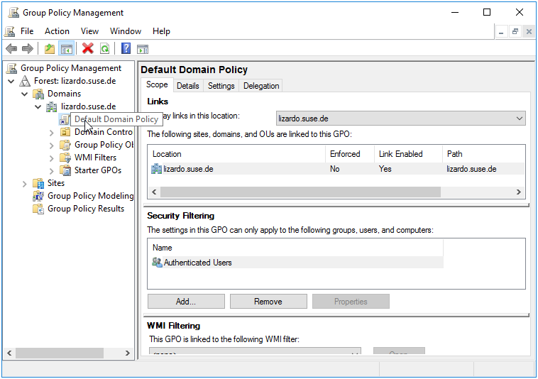
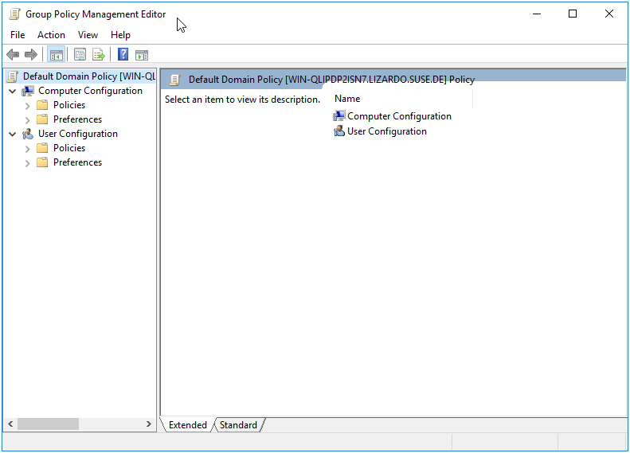
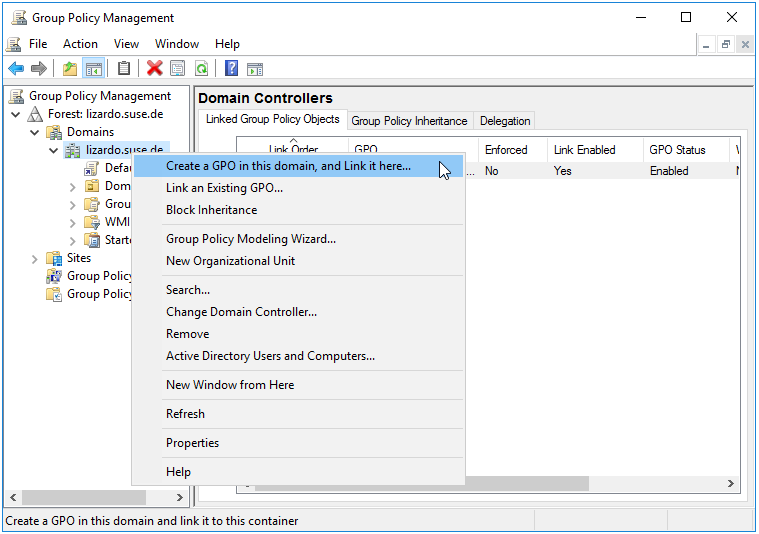

# Managing Group Policies {#manage}

```{r, echo=FALSE, out.width="30%", fig.align='center'}

```

Before diving into specific Group Policies, let's review the basics of managing Group Policy.

A Windows Active Directory Administrator should know that Group Policies are managed via the Group Policy Management Console (GPMC). Unfortunately there isn't a similar tool for Samba Active Directory Administrators. The Samba project does provide the comprehensive `samba-tool gpo` command, which supplants much of the GPMC.
\index{Group Policy Management Console}

There are instances where Samba's Group Policy can only be managed via the GPMC, with no `samba-tool gpo` alternative. These cases will be highlighted in the text.

## Opening a Group Policy Object in the Group Policy Management Console {#gpopen}

To open the Default Domain Policy (for example) in the Group Policy Management Console:

1. Open the Group Policy Management Console by going to Start > Administrative Tools > Group Policy Management.

2. In the Group Policy Management Console, expand the Forest node, then expand the Domains node.

3. Select the domain that contains the Default Domain Policy.

```{r, out.width="70%", echo=FALSE, fig.align='center', fig.pos = 'H', fig.cap = "Group Policy Management Console"}

```

4. In the right pane, right-click on the Default Domain Policy and select "Edit" from the context menu.

5. The Group Policy Management Editor window will open, allowing you to view and edit the Default Domain Policy.

\index{Group Policy Management Editor}

```{r, out.width="70%", echo=FALSE, fig.align='center', fig.pos = 'H', fig.cap = "Default Domain Policy"}

```

Note: You will need to have the appropriate permissions to edit the Default Domain Policy. If you do not have the necessary permissions, you will not be able to edit the policy.

## Creating a Group Policy Object {#gpcreate}

### samba-tool

The `samba-tool gpo create` command is used to create a Group Policy Object (GPO). To create a GPO using the `samba-tool gpo create` command, you would use the following syntax:
\index{Group Policy Object}

```sh
samba-tool gpo create GPO_NAME
```

Where `GPO_NAME` is the name of the GPO that you want to create. This name should be unique within the domain, as it will be used to identify the GPO when it is linked to a domain or organizational unit (OU).

Once the GPO has been created, you can use the `samba-tool gpo setlink` command to add or update a GPO link to a container. The syntax for this command is:
\index{GPO Link}

```sh
samba-tool gpo setlink CONTAINER_DN GPO_NAME
```

Where `CONTAINER_DN` is the distinguished name of the container from which you want to create the GPO link, and `GPO_NAME` is the name of the GPO you want to link.

### GPMC

To create a Group Policy object (GPO) using the Group Policy Management Console (GPMC):
\index{Group Policy Object}

1. Open the GPMC by going to `Start > Administrative Tools > Group Policy Management`.

2. In the GPMC, expand the Domains node in the tree, and then expand the domain where you want to create the GPO.

3. Right-click on the domain, or the container where you'd like the GPO created and linked, and select `Create a GPO in this domain, and Link it here...`.

\index{GPO Link}

```{r, out.width="70%", echo=FALSE, fig.align='center', fig.pos = 'H', fig.cap = "Create a GPO"}

```

4. In the `New GPO` dialog box, enter a name for the GPO and click on the `OK` button.

5. The new GPO will be created and will appear in the list of GPOs under the `Group Policy Objects` node.

## Deleting a Group Policy Object {#gpdelete}

### samba-tool

To delete a Group Policy Object (GPO), you would use the `samba-tool gpo del` command. The syntax for this command is:
\index{Group Policy Object}

```sh
samba-tool gpo del GPO_NAME
```

Where `GPO_NAME` is the name of the GPO you want to delete.

This command will delete the GPO from the server. Keep in mind that this operation cannot be undone, so make sure you really want to delete the GPO before running this command.

To delete a Group Policy Object (GPO) link from a container, you would use the `samba-tool gpo dellink` command. The syntax for this command is:
\index{GPO Link}

```sh
samba-tool gpo dellink CONTAINER_DN GPO_NAME
```

Where `CONTAINER_DN` is the distinguished name of the container from which you want to delete the GPO link, and `GPO_NAME` is the name of the GPO you want to unlink.

### GPMC

To delete a Group Policy object (GPO) using the Group Policy Management Console (GPMC):
\index{Group Policy Object}

1. In the left pane of the GPMC, expand the forest and domain that contain the GPO you want to delete.

2. In the left pane, select the Group Policy Objects container. This will display a list of GPOs in the right pane.

3. In the right pane, right-click the GPO you want to delete and select "Delete."

4. A warning message will appear, asking you to confirm that you want to delete the GPO. Click "Yes" to delete the GPO.

## Listing a Group Policy {#gplist}

To list the contents of a Group Policy Object (GPO), you would use the `samba-tool gpo list` command. The syntax for this command is:

```sh
samba-tool gpo list GPO_NAME
```

Where `GPO_NAME` is the name of the GPO you want to list the contents of.

This command will list all of the settings and policies contained in the specified GPO.

## Modifying a Group Policy {#gpmodify}

The `samba-tool gpo manage` is used for modifying settings on a Group Policy Object. See the individual chapters for each subcommand explanation.

```{r, echo=FALSE}
knitr::kable(
  data.frame(
    "Command" = c(
      "samba-tool gpo manage smb_conf",
      "samba-tool gpo manage security",
      "samba-tool gpo manage scripts startup",
      "samba-tool gpo manage files",
      "samba-tool gpo manage symlink",
      "samba-tool gpo manage sudoers",
      "samba-tool gpo manage issue",
      "samba-tool gpo manage motd",
      "samba-tool gpo manage access",
      "samba-tool gpo manage openssh"
    ),
    "Chapter" = c(
      "4",
      "5",
      "7",
      "8",
      "9",
      "10",
      "11",
      "11",
      "12",
      "17"
    )
  )
)
```

Each of these subcommands has its own set of options and parameters that can be used to specify the details of the operation. For more information on a specific subcommand, you can consult the documentation for that subcommand.

Additionally, the `samba-tool gpo load` and `samba-tool gpo remove` commands (see section \@ref(regpol-samba-tool)) may be used to modify any policy which is loaded to the SYSVOL in a `Registry.pol` file. This applies to [smb.conf policies](#smbconf), [Script Policies](#scripts), [Sudoers Policies](#sudoers), [Message Policies](#msgs), [Certificate Auto Enrollment Policy (advanced configuration only)](#certautoenroll), [Firefox Policy](#firefox), [Chromium/Chrome Policy](#chrome), [GNOME Settings Policy](#gnome), and [Firewalld Policy](#firewalld).
\index{Policies!smb.conf}
\index{Policies!Password}
\index{Policies!Kerberos}
\index{Policies!Startup Script}
\index{Policies!Files}
\index{Policies!Symlink}
\index{Policies!Sudoers}
\index{Policies!Message}
\index{Policies!PAM Access}
\index{Policies!OpenSSH}
\index{Policies!Script}
\index{Policies!Certificate Auto Enrollment}
\index{Policies!Firefox}
\index{Policies!Chromium/Chrome}
\index{Policies!GNOME Settings}
\index{Policies!Firewalld}
