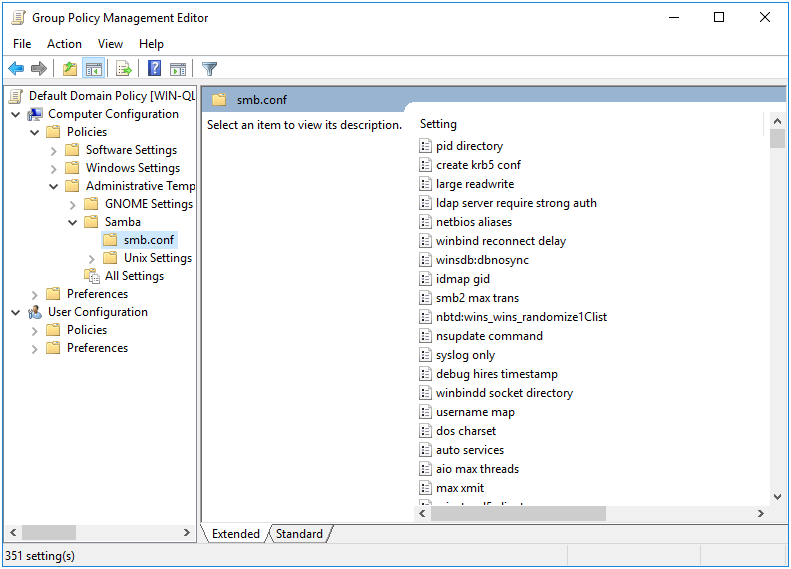
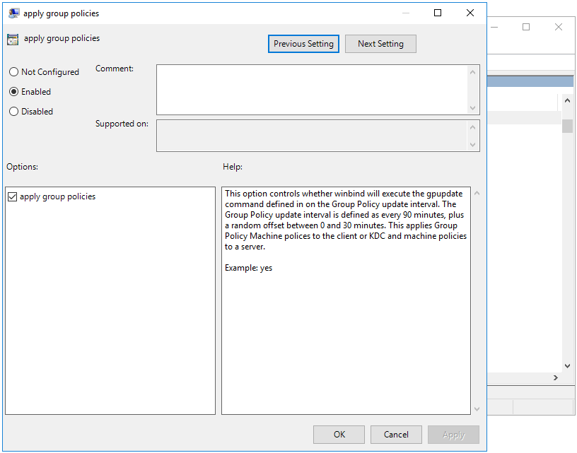

# smb.conf Policies {#smbconf}

The purpose of the smb.conf policies is to be able to distribute smb.conf settings to Linux clients. This policy only supports a physical smb.conf file, and currently does not support smb.conf registry settings.

## Server Side Extension

The Server Side Extension for smb.conf policies is distributed using Administrative Templates (ADMX). Refer to chapter \@ref(sse) in section \@ref(admx) for details about Administrative Templates.

The smb.conf ADMX templates are distributed with the Samba binaries. Consult with your Samba maintainer as to where these templates are packaged. On openSUSE, for example, they are packaged in the samba-ad-dc package.

To install the smb.conf ADMX, you use the `samba-tool gpo admxload` command.

```
samba-tool gpo admxload --realm=REALM -UAdministrator --admx-dir=/usr/share/samba/admx
```

When running this command, you should be able to ommit the `--admx-dir` if the Samba ADMX templates are installed. You can also ommit the `--realm` option if the machine is joined to the domain.

### Managing smb.conf Policies via the GPME

After successfully installing the ADMX templates, open the Group Policy Management Editor (GPME) and navigate to `Computer Configuration > Policies > Administrative Templates > Samba > smb.conf`. For instructions on accessing the GPME, see chapter \@ref(manage) section \@ref(gpcreate).



For this example, we're going to enable the `apply group policies` setting. This setting instructs Winbind to execute the `samba-gpupdate` command on the Group Policy interval (every 90 to 120 minutes). There are many other settings available here, but notice that idmap policies are not. That's because idmap policies modify the setting name (not just the value).



Apply the policy change, and close the GPME.

### Managing smb.conf Policies via samba-tool

Setting an smb.conf Group Policy is arguably much simpler.

```
> samba-tool gpo manage smb_conf set --help
Usage: samba-tool gpo manage smb_conf set <gpo> <setting> <value> [options]

Sets a Samba smb.conf Group Policy to the sysvol

This command sets an smb.conf setting to the sysvol for applying to winbind
clients. Not providing a value will unset the policy.

Example:
samba-tool gpo manage smb_conf set {31B2F340-016D-11D2-945F-00C04FB984F9}
'apply gpo policies' yes
```

This command does not require the ADMX templates to be installed, and also does not suffer from the same limitation as the GPME for idmap policies.

## Client Side Extension
