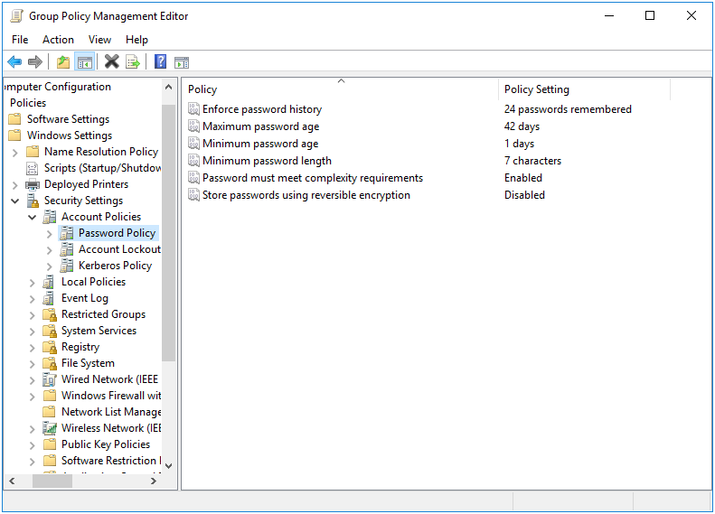
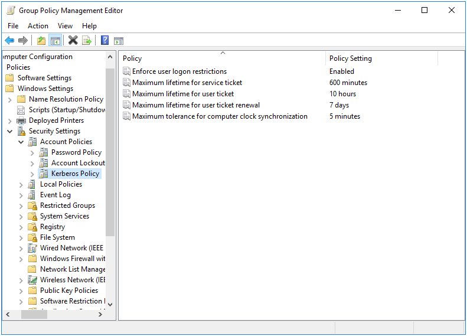

# Password and Kerberos Policies {#sec}

```{r, echo=FALSE, out.width="30%", fig.align='center'}

```

The purpose of these policies is to enforce password complexity and kerberos rules on a Samba Active Directory Domain Controller (ADDC). When a Linux client is not an ADDC, these policies are disabled and ignored automatically.

These policies are physically stored on the SYSVOL in the **MACHINE/Microsoft/Windows NT/SecEdit/GptTmpl.inf** file in the subdirectory of the Group Policy Object. They are stored in ini format, and are easily modified manually using a text editor.

## Server Side Extension

The Group Policy Management Editor (GPME) contains a built in Server Side Extension for Password and Kerberos Policies. There is also a `samba-tool` command to modify these policies.

### Managing Password and Kerberos Policies via the GPME

Open the GPME and navigate to `Computer Configuration > Policies > Windows Settings > Security Settings > Account Policy`.

The following password policies are applicable to a Samba ADDC:

* Maximum password age
* Minimum password age
* Minimum password length
* Password must meet complexity requirements



The following Kerberos policies are applicable to a Samba ADDC:

* Maximum lifetime for service ticket
* Maximum lifetime for user ticket
* Maximum lifetime for user ticket renewal



### Managing Password and Kerberos Policies via samba-tool

The Password and Kerberos policies can also be set via `samba-tool`.

```
> samba-tool gpo manage security set --help
Usage: samba-tool gpo manage security set <gpo> <setting> <value> [options]

Set Samba Security Group Policy to the sysvol

This command sets a security setting to the sysvol for applying to winbind
clients. Not providing a value will unset the policy.
These settings only apply to the ADDC.

Example:
samba-tool gpo manage security set {31B2F340-016D-11D2-945F-00C04FB984F9} MaxTicketAge 10

Possible policies:
MaxTicketAge            Maximum lifetime for user ticket
                        Defined in hours

MaxServiceAge           Maximum lifetime for service ticket
                        Defined in minutes

MaxRenewAge             Maximum lifetime for user ticket renewal
                        Defined in minutes

MinimumPasswordAge      Minimum password age
                        Defined in days

MaximumPasswordAge      Maximum password age
                        Defined in days

MinimumPasswordLength   Minimum password length
                        Defined in characters

PasswordComplexity      Password must meet complexity requirements
                        1 is Enabled, 0 is Disabled
```

## Client Side Extension

The Password and Kerberos policies are seperated into two Client Side Extensions (CSE), `gp_access_ext` and `gp_krb_ext`. The Password policies (internally known as *System Access*) apply password complexity rules directly to the ADDC SamDB in the applicable LDAP attributes. The Kerberos policies are stored in our Group Policy Log, and are fetched directly by the `samba` daemon when it loads.

In the previous section we saw that our Password and Kerberos policies were already initialized to some defaults. If we now go to our Linux client, and check the Resultant Set of Policy, we see this:

```
> sudo /usr/sbin/samba-gpupdate --rsop
Resultant Set of Policy
Computer Policy

GPO: Default Domain Policy
=================================================================
  CSE: gp_access_ext
  -----------------------------------------------------------
    Policy Type: System Access
    -----------------------------------------------------------
    [ MinimumPasswordAge ] = 1
    [ MaximumPasswordAge ] = 42
    [ MinimumPasswordLength ] = 7
    [ PasswordComplexity ] = 1
    -----------------------------------------------------------
  -----------------------------------------------------------
  CSE: gp_krb_ext
  -----------------------------------------------------------
    Policy Type: Kerberos Policy
    -----------------------------------------------------------
    [ MaxTicketAge ] = 10
    [ MaxRenewAge ] = 7
    [ MaxServiceAge ] = 600
    -----------------------------------------------------------
  -----------------------------------------------------------
=================================================================
```

::: {#info style="color: green;"}
Remember that these policies will only be listed if your Linux client is a Samba ADDC.
:::

Let's now force a policy apply, and check that the settings have changed.

```
> sudo /usr/sbin/samba-gpupdate --force
> sudo tdbdump /var/lib/samba/gpo.tdb -k "TESTSYSDM$" | sed -r "s/\\\22/\"/g" | xmllint --format -
<?xml version="1.0"?>
<gp>
  <user name="TESTSYSDM$">
    <guid value="{31B2F340-016D-11D2-945F-00C04FB984F9}">
      <gp_ext name="System Access">
        <attribute name="minPwdAge"/>
        <attribute name="maxPwdAge"/>
        <attribute name="minPwdLength"/>
        <attribute name="pwdProperties"/>
      </gp_ext>
      <gp_ext name="Kerberos Policy">
        <attribute name="kdc:user_ticket_lifetime"/>
        <attribute name="kdc:renewal_lifetime"/>
        <attribute name="kdc:service_ticket_lifetime"/>
      </gp_ext>
    </guid>
    <applylog>
      <guid count="0" value="{31B2F340-016D-11D2-945F-00C04FB984F9}"/>
    </applylog>
  </user>
</gp>
> sudo tdbdump /var/lib/samba/gpo.tdb -k 'kdc:user_ticket_lifetime'; echo
10
> sudo tdbdump /var/lib/samba/gpo.tdb -k 'kdc:service_ticket_lifetime'; echo
10
> sudo tdbdump /var/lib/samba/gpo.tdb -k 'kdc:renewal_lifetime'; echo
168
```

You can see the Kerberos policies are all stored in their own keys in the Group Policy Log (`/var/lib/samba/gpo.tdb`), and they are all stored in hours. On the SYSVOL, they are actually stored in hours, minutes, and days, respectively. The reason these are all stored in hours on the system is that the `samba` daemon expects these attributes in hours.

If we check the contents of the GptTmpl.inf and do some conversion, we can confirm these are correct.

```ini
[Kerberos Policy]
MaxTicketAge = 10
MaxServiceAge = 600
MaxRenewAge = 7
```

```python
>>> from samba.gp.gp_sec_ext import mins_to_hours, days_to_hours
>>> MaxTicketAge = 10
>>> MaxServiceAge = 600
>>> MaxRenewAge = 7
>>> mins_to_hours(MaxServiceAge)
'10'
>>> days_to_hours(MaxRenewAge)
'168'
```

It also helps to know how these Kerberos policies map to the `samba` daemon settings.

<table>
 <thead>
  <tr>
   <th style="text-align:left;">Kerberos Policy</th>
   <th style="text-align:left;">Samba Setting</th>
   <th style="text-align:left;">Conversion</th>
  </tr>
 </thead>
<tbody>
  <tr>
   <td>MaxTicketAge</td>
   <td>kdc:user\_ticket\_lifetime</td>
   <td>None</td>
  </tr>
  <tr>
   <td>MaxServiceAge</td>
   <td>kdc:service\_ticket\_lifetime</td>
   <td>Minutes to Hours</td>
  </tr>
  <tr>
   <td>MaxRenewAge</td>
   <td>kdc:renewal\_lifetime</td>
   <td>Days to Hours</td>
  </tr>
</tbody>
</table>

While the Kerberos policies have been stored to the Group Policy Log as expected, let's next verify that the Password policies have been applied using the following ldapsearch.

```
> ldapsearch -H ldap://lizardo.suse.de -x -W -D "Administrator@lizardo.suse.de" -b DC=lizardo,DC=suse,DC=de -s base minPwdAge maxPwdAge minPwdLength pwdProperties
# lizardo.suse.de
dn: DC=lizardo,DC=suse,DC=de
maxPwdAge: -36288000000000
minPwdAge: -864000000000
minPwdLength: 7
pwdProperties: 1
```

We can confirm these were set correctly by checking the contents of the GptTmpl.inf, plus doing some type conversion.

```ini
[System Access]
MinimumPasswordAge = 1
MaximumPasswordAge = 42
MinimumPasswordLength = 7
PasswordComplexity = 1
```

```python
>>> from samba.gp.gp_sec_ext import days2rel_nttime
>>> MinimumPasswordAge = 1
>>> MaximumPasswordAge = 42
>>> MinimumPasswordLength = 7
>>> PasswordComplexity = 1
>>> days2rel_nttime(MaximumPasswordAge)
'-36288000000000'
>>> days2rel_nttime(MinimumPasswordAge)
'-864000000000'
```

Finally, here is how these policies map.

<table>
 <thead>
  <tr>
   <th style="text-align:left;">Password Policy</th>
   <th style="text-align:left;">LDAP Attribute</th>
   <th style="text-align:left;">Conversion</th>
  </tr>
 </thead>
<tbody>
  <tr>
   <td>MinimumPasswordAge</td>
   <td>minPwdAge</td>
   <td>Days to NTTIME</td>
  </tr>
  <tr>
   <td>MaximumPasswordAge</td>
   <td>maxPwdAge</td>
   <td>Days to NTTIME</td>
  </tr>
  <tr>
   <td>MinimumPasswordLength</td>
   <td>minPwdLength</td>
   <td>None</td>
  </tr>
  <tr>
   <td>PasswordComplexity</td>
   <td>pwdProperties</td>
   <td>None</td>
  </tr>
</tbody>
</table>
