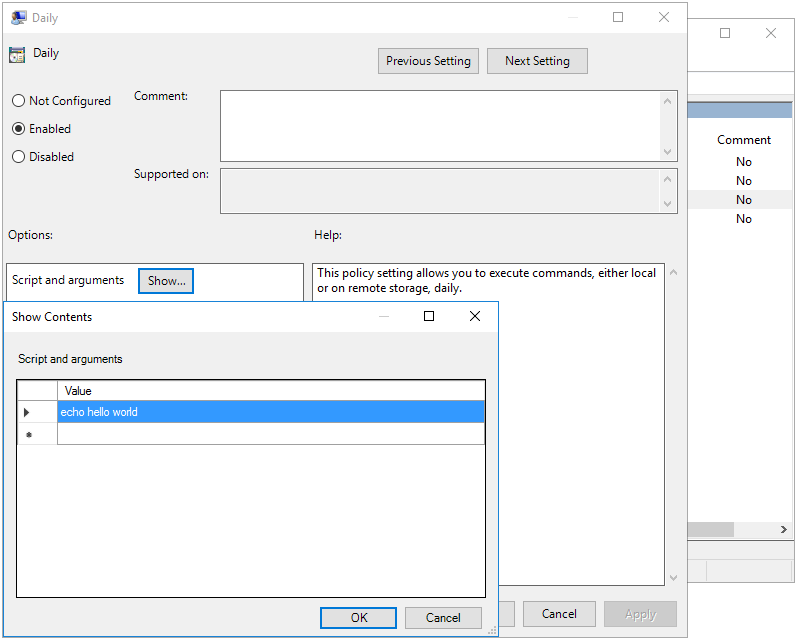
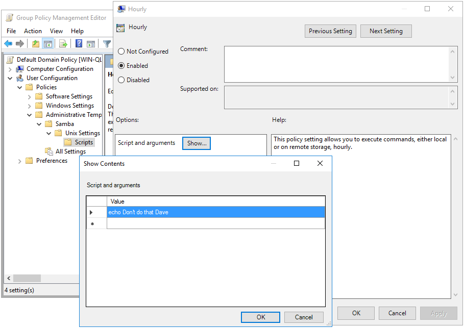

# Script Policies {#scripts}

```{r, echo=FALSE, out.width="30%", fig.align='center'}
knitr::include_graphics("scripts-images/write.png")
```

The purpose of this policy is to schedule cron jobs on a Linux client. Both Machine and User policy is supported. This policy does not upload a script for execution, it only schedules an existing script to run. To first load a script onto the client, see the Files Policy in chapter \@ref(files).

This policy is physically stored on the SYSVOL in the **MACHINE/Registry.pol** and **USER/Registry.pol** files within the subdirectory of the Group Policy Object. It is stored in registry format. See chapter \@ref(regpol) for details on how to manually modify this file.

## Server Side Extension

The Server Side Extension for smb.conf policies is distributed using Administrative Templates (ADMX). Refer to chapter \@ref(sse) in section \@ref(admx) for details about Administrative Templates.

Setting up the ADMX templates for this policy is described in chapter \@ref(smbconf) section \@ref(smbconf-sse).

### Managing Machine Scripts Policies via the GPME {#scripts-gpme}

Open the Group Policy Management Editor (GPME) and navigate to `Computer Configuration > Policies > Administrative Templates > Samba > Unix Settings > Scripts`. For instructions on accessing the GPME, see chapter \@ref(manage) section \@ref(gpcreate).


As an example, we'll create a simple cron job which echo's "hello world" once every day.



### Managing User Scripts Policies via the GPME

Next we'll create a user script that echo's the text "Don't do that Dave" every hour. Open the Group Policy Management Editor (GPME) and navigate to `User Configuration > Policies > Administrative Templates > Samba > Unix Settings > Scripts`.



## Client Side Extension

The Scripts Client Side Extension (CSE) creates cron jobs on the Linux client. For Machine policy, these jobs are installed in a file within the `/etc/cron.daily`, `/etc/cron.monthly`, `/etc/cron.weekly` and `/etc/cron.hourly` directories. For User policy, the user's crontab file is directly modified.

In the previous section we created two test Script policies. If we now go to our Linux client, and check the Resultant Set of Policy, we see this:


```
> sudo /usr/sbin/samba-gpupdate --rsop
Resultant Set of Policy
Computer Policy

GPO: Default Domain Policy
=================================================================
  -----------------------------------------------------------
  CSE: gp_scripts_ext
  -----------------------------------------------------------
    Policy Type: Daily Scripts
    -----------------------------------------------------------
    [ echo hello world ]
    -----------------------------------------------------------
  -----------------------------------------------------------
  CSE: gp_centrify_crontab_ext
  -----------------------------------------------------------
    Policy Type: Centrify/CrontabEntries
    -----------------------------------------------------------
    [ @daily echo hello world from Centrify ]
    -----------------------------------------------------------
  -----------------------------------------------------------
=================================================================
> sudo /usr/sbin/samba-gpupdate --target=User -U tux --rsop
Resultant Set of Policy
User Policy

GPO: Default Domain Policy
=================================================================
  CSE: gp_user_scripts_ext
  -----------------------------------------------------------
    Policy Type: Hourly Scripts
    -----------------------------------------------------------
    [ echo Don't do that Dave ]
    -----------------------------------------------------------
  -----------------------------------------------------------
  CSE: gp_user_centrify_crontab_ext
  -----------------------------------------------------------
    Policy Type: Centrify/CrontabEntries
    -----------------------------------------------------------
    [ @hourly echo Don't do that Dave from Centrify ]
    -----------------------------------------------------------
  -----------------------------------------------------------
=================================================================
```

In addition to the expected scripts that we added previously, you'll notice there are 2 additional entries. The `gp_centrify_crontab_ext` and `gp_user_centrify_crontab_ext` CSEs parse policies provided by a Centrify Server Side Extension. These weren't introduced previously in the chapter because they are a proprietary solution not provided by Samba. Samba provides a CSE to apply these for compatability reasons, but does not provide a SSE to set them. These CSEs are provided to assist in migration from proprietary technologies. We won't discuss these any further.

Let's now force an apply, and verify that the cron jobs are scheduled.

```
> sudo /usr/sbin/samba-gpupdate --force
> sudo tdbdump /var/lib/samba/gpo.tdb -k "TESTSYSDM$" | sed -r "s/\\\22/\"/g" | sed -r "s/\\\5C/\\\\/g" | xmllint --format -
<?xml version="1.0"?>
<gp>
  <user name="TESTSYSDM$">
    <guid value="{31B2F340-016D-11D2-945F-00C04FB984F9}">
      <gp_ext name="Unix Settings/Scripts">
        <attribute name="Software\Policies\Samba\Unix Settings\Daily Scripts:ZWNobyBoZWxsbyB3b3JsZA==">/etc/cron.daily/gp_m94kdru9</attribute>
      </gp_ext>
    </guid>
    <applylog>
      <guid count="0" value="{31B2F340-016D-11D2-945F-00C04FB984F9}"/>
    </applylog>
  </user>
</gp>
> sudo /usr/sbin/samba-gpupdate --target=User -U tux --force
> sudo tdbdump /var/lib/samba/gpo.tdb -k "LIZARDO\\tux" | sed -r "s/\\\22/\"/g" | sed -r "s/\\\5C/\\\\/g" | xmllint --format -
<?xml version="1.0"?>
<gp>
  <user name="LIZARDO\tux">
    <guid value="{31B2F340-016D-11D2-945F-00C04FB984F9}">
      <gp_ext name="Unix Settings/Scripts">
        <attribute name="Software\Policies\Samba\Unix Settings\Hourly Scripts:94d6cccd227ea60f662a2ea161560329df75d24b64265c405ba16209c715a0bb274b39b07d2c825dc926341839067d90a80d5570b2c68607b16915fd806de415">@hourly echo Don't do that Dave</attribute>
      </gp_ext>
    </guid>
    <applylog>
      <guid count="0" value="{31B2F340-016D-11D2-945F-00C04FB984F9}"/>
    </applylog>
  </user>
</gp>
```

First we see that the machine policy created the script `/etc/cron.daily/gp_m94kdru9`. Let's take a look at the contents.

```bash
> sudo cat /etc/cron.daily/gp_m94kdru9
#!/bin/sh

### autogenerated by samba
#
# This file is generated by the gp_scripts_ext Group Policy
# Client Side Extension. To modify the contents of this file,
# modify the appropriate Group Policy objects which apply
# to this machine. DO NOT MODIFY THIS FILE DIRECTLY.
#

echo hello world
```

Next we notice that the user policy created the entry `@hourly echo Don't do that Dave`. If we inspect the crontab of the user `tux`, we see the entry.

```
> sudo crontab -l -u LIZARDO\\tux
### autogenerated by samba
#
# This file is generated by the gp_scripts_ext Group Policy
# Client Side Extension. To modify the contents of this file,
# modify the appropriate Group Policy objects which apply
# to this machine. DO NOT MODIFY THIS FILE DIRECTLY.
#

@hourly echo Don't do that Dave

### autogenerated by samba ###
```
