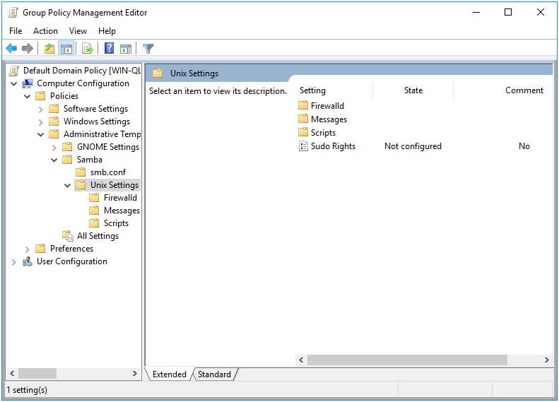
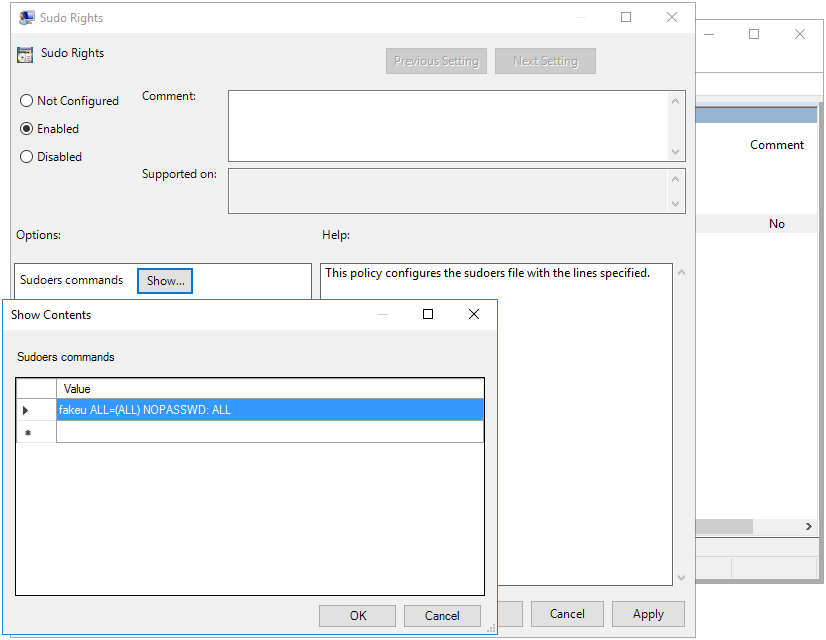

# Sudoers Policies {#sudoers}

```{r, echo=FALSE, out.width="30%", fig.align='center'}

```

The purpose of the Sudoers Polices are to deploy sudo rules to a Linux client. Naturally, only Machine policy is supported.

This policy is physically stored in two different locations on the SYSVOL, in **MACHINE/Registry.pol** and in **MACHINE/VGP/VTLA/Sudo/** **SudoersConfiguration/manifest.xml**. The `manifest.xml` is in xml format, and is easily modified manually using a text editor. The `Registry.pol` is in registry format. See chapter \@ref(regpol) for details on how to manually modify this file.

## Server Side Extension

The Server Side Extensions (SSE) for Sudoers policies are distributed via either Administrative Templates (see \@ref(sse) in section \@ref(admx)) or via the command `samba-tool gpo manage sudoers`. Rules added via the GPME can be modified from samba-tool (as of Samba 4.18), but rules added via `samba-tool gpo manage sudoers` will not be visible in the GPME.

### Managing Sudoers Policy via the GPME {#sudoers-gpme}

Setting up the ADMX templates for this policy is described in chapter \@ref(install-admx) section \@ref(install-admx-samba).

To add a new sudo rule using the Group Policy Management Editor (GPME):

1. Open the Group Policy Management Editor. For instructions on accessing the GPME, see chapter \@ref(manage) section \@ref(gpopen).

2. In the Group Policy Management Editor window, navigate to `Computer Configuration > Policies > Administrative Templates > Samba > Unix Settings`.

```{r, out.width="70%", echo=FALSE, fig.align='center', fig.pos = 'H', fig.cap = "Group Policy Management Editor"}

```

3. In the right pane, double-click on the "Sudo Rights" setting.

4. In the "Sudo Rights" dialog box, click on the "Show" button next to "Sudoers commands".

5. In the "Show Contents" dialog box, enter a new sudo rule.

6. Click "OK" to save the new sudo rule and close the dialog box.

```{r, out.width="70%", echo=FALSE, fig.align='center', fig.pos = 'H', fig.cap = "Adding a Sudo Rule"}

```

After applying this rule, you can list the rule using `samba-tool`.

```
> samba-tool gpo manage sudoers list \
 {31B2F340-016D-11D2-945F-00C04FB984F9} -UAdministrator
fakeu ALL=(ALL) NOPASSWD: ALL
```

### Managing Sudoers Policy via samba-tool {#sudoers-samba-tool}

The Sudoers Policy can also be set via the `samba-tool gpo manage sudoers` command, which has 3 subcommands; add, list, and remove.

```
> samba-tool gpo manage sudoers --help
Usage: samba-tool gpo manage sudoers <subcommand>

Manage Sudoers Group Policy Objects


Options:
  -h, --help  show this help message and exit


Available subcommands:
  add     - Adds a Samba Sudoers Group Policy to the sysvol
  list    - List Samba Sudoers Group Policy from the sysvol
  remove  - Removes a Samba Sudoers Group Policy from the sysvol
```

To add a new Sudoers rule to the SYSVOL, call the `samba-tool gpo manage sudoers add` command.

```sh
samba-tool gpo manage sudoers add <gpo> <command> <user> <users>
```

Let's add a simple rule for testing.

```
> samba-tool gpo manage sudoers add \
 {31B2F340-016D-11D2-945F-00C04FB984F9} ALL ALL fakeu fakeg \
 -UAdministrator
> samba-tool gpo manage sudoers list \
 {31B2F340-016D-11D2-945F-00C04FB984F9} -UAdministrator
fakeu,fakeg% ALL=(ALL) NOPASSWD: ALL
fakeu ALL=(ALL) NOPASSWD: ALL
```

You'll notice that listing the entries now includes the entry we just created, as well as the one we added earlier using the GPME.

## Client Side Extension

Samba actually supplies 3 different Client Side Extensions (CSE) for the Sudoers policy. This is to support 3 different SSE providers. The first is Samba's original policy, which is modified using the GPME as explained in section \@ref(sudoers-gpme). The second is the Vintela compatible policy, which can be set using `samba-tool` as explained in section \@ref(sudoers-samba-tool). The final CSE is the Centrify compatible policy, which is only provided as a convenience for migration. All these CSEs behave the same in how they apply policy (and share some of the same code). The preceeding instructions refer to all three CSEs.

The Sudoer CSEs create a file within `/etc/sudoers.d` for each rule specified on the SYSVOL. Each rule is validated before installing, to ensure the system isn't left in a broken state.

Let’s list the Resultant Set of Policy to view the Sudoer rules we created in the previous sections.

```
> sudo /usr/sbin/samba-gpupdate --rsop
Resultant Set of Policy
Computer Policy

GPO: Default Domain Policy
=================================================================
  CSE: gp_sudoers_ext
  -----------------------------------------------------------
    Policy Type: Sudo Rights
    -----------------------------------------------------------
    [ fakeu ALL=(ALL) NOPASSWD: ALL ]
    -----------------------------------------------------------
  -----------------------------------------------------------
  CSE: vgp_sudoers_ext
  -----------------------------------------------------------
    Policy Type: VGP/Unix Settings/Sudo Rights
    -----------------------------------------------------------
    [ fakeu,fakeg% ALL=(ALL) NOPASSWD: ALL ]
    -----------------------------------------------------------
  -----------------------------------------------------------
  CSE: gp_centrify_sudoers_ext
  -----------------------------------------------------------
  -----------------------------------------------------------
=================================================================
```

Notice that both the rules we created earlier are listed, but under different CSEs. These policies will be applied by different CSEs because they are stored on the SYSVOL differently. The results will be similar though. Currently we don't have any Centrify combatible policy in our environment, so this CSE remains empty.

Let’s now force our policy to apply and see how the CSEs behave.

```
> sudo /usr/sbin/samba-gpupdate --force
> sudo tdbdump /var/lib/samba/gpo.tdb -k "TESTSYSDM$" \
 | sed -r "s/\\\22/\"/g" | sed -r "s/\\\5C/\\\\/g" \
 | xmllint --xpath "//gp_ext[@name='Unix Settings/Sudo Rights' or 
                     @name='VGP/Unix Settings/Sudo Rights']" - \
 | xmllint --format -
<gp_ext name="Unix Settings/Sudo Rights">
  <attribute name="ZmFrZXUgQUxMPShBTEwpIE5PUEFTU1dEOiBBTEw=">
    /etc/sudoers.d/gp_mzarfh6k
  </attribute>
</gp_ext>
<gp_ext name="VGP/Unix Settings/Sudo Rights">
  <attribute name="ZmFrZXUsZmFrZWclIEFMTD0oQUxMKSBOT1BBU1NXRDogQUxM">
    /etc/sudoers.d/gp_qy2eo07y
  </attribute>
</gp_ext>
```

We can see the Sudoer rules have been applied to `/etc/sudoers.d/gp_mzarfh6k` and `/etc/sudoers.d/gp_qy2eo07y`.

```
> sudo cat /etc/sudoers.d/gp_mzarfh6k

### autogenerated by samba
#
# This file is generated by the gp_sudoers_ext Group Policy
# Client Side Extension. To modify the contents of this file,
# modify the appropriate Group Policy objects which apply
# to this machine. DO NOT MODIFY THIS FILE DIRECTLY.
#

fakeu ALL=(ALL) NOPASSWD: ALL
> sudo cat /etc/sudoers.d/gp_qy2eo07y

### autogenerated by samba
#
# This file is generated by the gp_sudoers_ext Group Policy
# Client Side Extension. To modify the contents of this file,
# modify the appropriate Group Policy objects which apply
# to this machine. DO NOT MODIFY THIS FILE DIRECTLY.
#

fakeu,fakeg% ALL=(ALL) NOPASSWD: ALL
```
