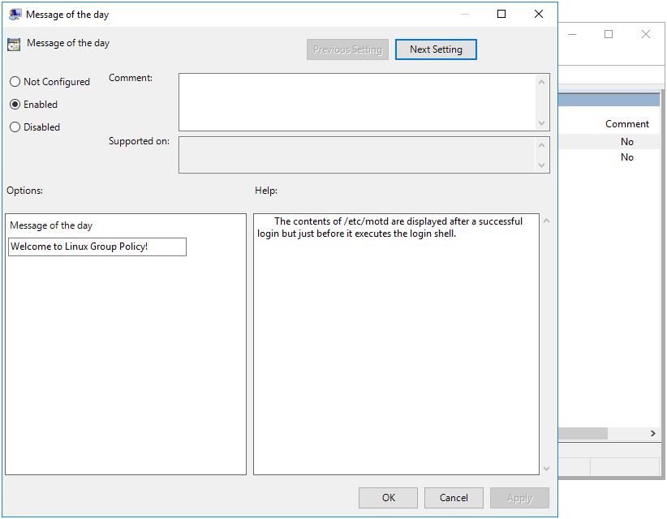
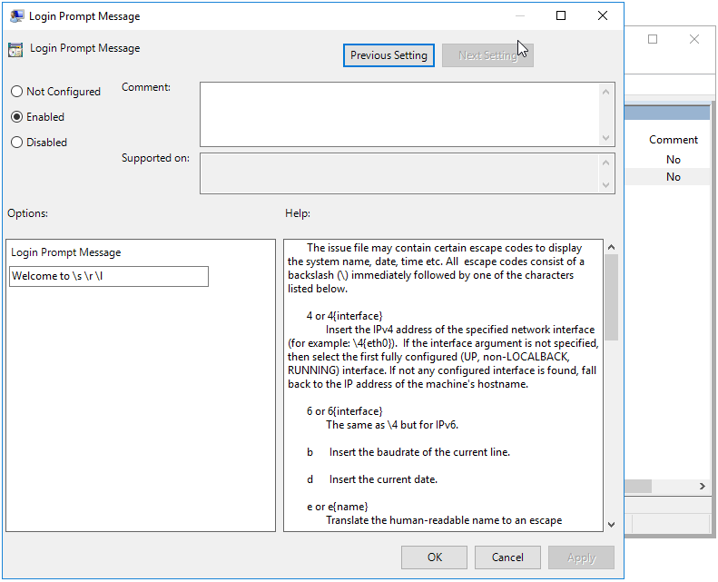

# Message Policies {#msgs}

```{r, echo=FALSE, out.width="30%", fig.align='center'}

```

The purpose of the Message policy is to set the contents of the `/etc/motd` and `/etc/issue` files. These are Machine only policies.

This policy is physically stored in three different locations on the SYSVOL, in **MACHINE/Registry.pol**, **MACHINE/VGP/VTLA/Unix/Issue/manifest.xml**, and **MACHINE/VGP/VTLA/Unix/MOTD/manifest.xml**. The `manifest.xml` files are in xml format, and are easily modified manually using a text editor. The `Registry.pol` is in registry format. See chapter \@ref(regpol) for details on how to manually modify this file.

## Server Side Extension

The Server Side Extensions (SSE) for Message policies are distributed via either Administrative Templates (see \@ref(sse) in section \@ref(admx)) or via the commands `samba-tool gpo manage motd` and `samba-tool gpo manage issue`. Rules added via GPME will not be visible to the respective `samba-tool` commands, and vice versa. This is because the `samba-tool` commands are intended to manage Vintela Group Policy compatability. These two SSEs should not be used in conjunction to one another, as it will cause unpredicatable results on the client.

### Managing Message Policy via the GPME

Open the GPME and navigate to `Computer Configuration > Policies > Administrative Templates > Samba > Unix Settings > Messages`.


Open the `Message of the day` and `Login Prompt Message` and edit the contents.





### Managing Message Policy via samba-tool

The `samba-tool gpo manage motd` and `samba-tool gpo manage issue` commands each have 2 subcommands; set and list.

```
> samba-tool gpo manage motd
Usage: samba-tool gpo manage motd <subcommand>

Manage Message of the Day Group Policy Objects


Options:
  -h, --help  show this help message and exit


Available subcommands:
  list  - List VGP MOTD Group Policy from the sysvol
  set   - Sets a VGP MOTD Group Policy to the sysvol
```

The syntax is the same for both `motd` and `issue`. The `list` command simply lists the current value of the setting, while the `set` command will set the contents of the setting.

```
> samba-tool gpo manage motd list --help
Usage: samba-tool gpo manage motd list <gpo> [options]

List VGP MOTD Group Policy from the sysvol

This command lists the Message of the Day from the sysvol that will be applied
to winbind clients.

Example:
samba-tool gpo manage motd list {31B2F340-016D-11D2-945F-00C04FB984F9}
> samba-tool gpo manage motd set --help
Usage: samba-tool gpo manage motd set <gpo> [value] [options]

Sets a VGP MOTD Group Policy to the sysvol

This command sets the Message of the Day to the sysvol for applying to winbind
clients. Not providing a value will unset the policy.

Example:
samba-tool gpo manage motd set {31B2F340-016D-11D2-945F-00C04FB984F9} "Message
for today"
```

Let's set some messages for testing later.

```
> samba-tool gpo manage motd set {31B2F340-016D-11D2-945F-00C04FB984F9} "motd set from samba-tool" -UAdministrator
> samba-tool gpo manage issue set {31B2F340-016D-11D2-945F-00C04FB984F9} "issue set from samba-tool" -UAdministrator
```

Doing a list for good measure, we see that the policy is set on the SYSVOL.

```
> samba-tool gpo manage motd list {31B2F340-016D-11D2-945F-00C04FB984F9} -UAdministrator; echo
motd set from samba-tool
dmulder@testsysdm:~> samba-tool gpo manage issue list {31B2F340-016D-11D2-945F-00C04FB984F9} -UAdministrator; echo
issue set from samba-tool
```
