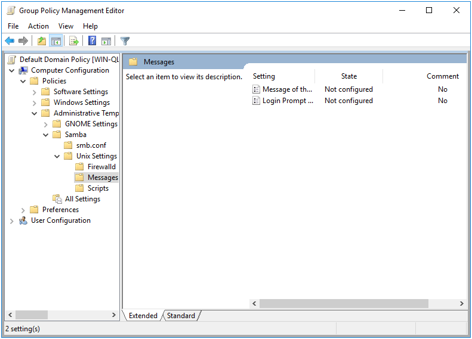

# Message Policies {#msgs}

```{r, echo=FALSE, out.width="30%", fig.align='center'}
knitr::include_graphics("msgs-images/msg.png")
```

The purpose of the Message policy is to set the contents of the `/etc/motd` and `/etc/issue` files. These are Machine only policies.

This policy is physically stored in three different locations on the SYSVOL, in **MACHINE/Registry.pol**, **MACHINE/VGP/VTLA/Unix/Issue/** **manifest.xml**, and **MACHINE/VGP/VTLA/Unix/MOTD/** **manifest.xml**. The `manifest.xml` files are in xml format, and are easily modified manually using a text editor. The `Registry.pol` is in registry format. See chapter \@ref(regpol) for details on how to manually modify this file.

## Server Side Extension

The Server Side Extensions (SSE) for Message policies are distributed via either Administrative Templates (see chapter \@ref(sse) in section \@ref(admx)) or via the commands `samba-tool gpo manage motd` and `samba-tool gpo manage issue`. Rules added via GPME will not be visible to the respective `samba-tool` commands, and vice versa. This is because the `samba-tool` commands are intended to manage Vintela Group Policy compatability. These two SSEs should not be used in conjunction to one another, as it will cause unpredicatable results on the client.

### Managing Message Policy via the GPME {#msgs-gpme}

Setting up the ADMX templates for this policy is described in chapter \@ref(install-admx) section \@ref(install-admx-samba).

To edit the "Message of the day" and "Login Prompt Message" settings using the Group Policy Management Editor (GPME):

1. Open the Group Policy Management Editor. For instructions on accessing the GPME, see chapter \@ref(manage) section \@ref(gpopen).

2. In the Group Policy Management Editor window, navigate to `Computer Configuration > Policies > Administrative Templates > Samba > Unix Settings > Messages`.



3. In the right pane, double-click on the "Message of the day" setting.

4. In the "Message of the day" dialog box, enter the desired message in the text field.

5. Click "OK" to save the changes and close the dialog box.


6. In the right pane, double-click on the "Login Prompt Message" setting.

7. In the "Login Prompt Message" dialog box, enter the desired message in the text field. The "Help" field on the right explains the various options for this message.

8. Click "OK" to save the changes and close the dialog box.


### Managing Message Policy via samba-tool {#msgs-samba-tool}

The `samba-tool gpo manage motd` and `samba-tool gpo manage issue` commands each have 2 subcommands; set and list.

```
> samba-tool gpo manage motd
Usage: samba-tool gpo manage motd <subcommand>

Manage Message of the Day Group Policy Objects


Options:
  -h, --help  show this help message and exit


Available subcommands:
  list  - List VGP MOTD Group Policy from the sysvol
  set   - Sets a VGP MOTD Group Policy to the sysvol
```

The syntax is the same for both `motd` and `issue`. The `list` command simply lists the current value of the setting, while the `set` command will set the contents of the setting.

To use the `samba-tool gpo manage motd list` command, you need to provide the name of the GPO as an argument. For example:

```sh
samba-tool gpo manage motd list \
  {31B2F340-016D-11D2-945F-00C04FB984F9}
```

To use the `samba-tool gpo manage motd set` command, you need to provide the name of the GPO as an argument, followed by the message you want to set as the MOTD. For example:

```sh
samba-tool gpo manage motd set \
 {31B2F340-016D-11D2-945F-00C04FB984F9} "Welcome to the server!
 Please make sure to read the guidelines before proceeding."
```

If no value is provided for the message, the MOTD will be unset and will not be displayed to users when they log in.

Let's set some messages for testing later.

```
> samba-tool gpo manage motd set \
 {31B2F340-016D-11D2-945F-00C04FB984F9} \
 "motd set from samba-tool" -UAdministrator
> samba-tool gpo manage issue set \
 {31B2F340-016D-11D2-945F-00C04FB984F9} \
 "issue set from samba-tool" -UAdministrator
```

Doing a list for good measure, we see that the policy is set on the SYSVOL.

```
> samba-tool gpo manage motd list \
 {31B2F340-016D-11D2-945F-00C04FB984F9} -UAdministrator; echo
motd set from samba-tool
> samba-tool gpo manage issue list \
 {31B2F340-016D-11D2-945F-00C04FB984F9} -UAdministrator; echo
issue set from samba-tool
```

## Client Side Extension

Samba provides 3 different Client Side Extensions (CSE) for the Messages policy. The Samba policy distributed via the GPME discussed in \@ref(msgs-gpme) called `gp_msgs_ext`, and the Vintela compatible policy split in 2 parts discussed in \@ref(msgs-samba-tool) called `vgp_motd_ext` and `vgp_issue_ext`.

These CSEs set the contents of `/etc/motd` and `/etc/issue`. If both Samba and Vintela compatible policies are set, they will conflict.

Let's list the Resultant Set of Policy to view what will be applied by `samba-gpupdate`.

```
> sudo /usr/sbin/samba-gpupdate --rsop
Resultant Set of Policy
Computer Policy

GPO: Default Domain Policy
=================================================================
  CSE: gp_msgs_ext
  -----------------------------------------------------------
    Policy Type: /etc/motd
    -----------------------------------------------------------
Welcome to Linux Group Policy!
    -----------------------------------------------------------
    Policy Type: /etc/issue
    -----------------------------------------------------------
Welcome to \s \r \l
    -----------------------------------------------------------
  -----------------------------------------------------------
  CSE: vgp_motd_ext
  -----------------------------------------------------------
    Policy Type: /etc/motd
    -----------------------------------------------------------
motd set from samba-tool
    -----------------------------------------------------------
  -----------------------------------------------------------
  CSE: vgp_issue_ext
  -----------------------------------------------------------
    Policy Type: /etc/issue
    -----------------------------------------------------------
issue set from samba-tool
    -----------------------------------------------------------
  -----------------------------------------------------------
=================================================================
```

Because both these policies are set, we can't predict which one will actually be applied. Let's do a force and see what the result is.

```
> sudo /usr/sbin/samba-gpupdate --force
> sudo tdbdump /var/lib/samba/gpo.tdb -k "TESTSYSDM$" \
 | sed -r "s/\\\22/\"/g" | sed -r "s/\\\5C/\\\\/g" \
 | xmllint --xpath "//gp_ext[@name='Unix Settings/Messages' or
                             @name='Unix Settings/Message
			     of the Day' or
                             @name='Unix Settings/Issue']" - \
 | xmllint --format -
<gp_ext name="Unix Settings/Messages">
  <attribute name="motd"/>
  <attribute name="issue">
    Welcome to openSUSE Tumbleweed
  </attribute>
</gp_ext>
<gp_ext name="Unix Settings/Message of the Day">
  <attribute name="motd">
    Welcome to Linux Group Policy!
  </attribute>
</gp_ext>
<gp_ext name="Unix Settings/Issue">
  <attribute name="issue">
    Welcome to \5Cs \5Cr \5Cl
  </attribute>
</gp_ext>
```

Note that Messages policy stores the previous value of the message content in the Group Policy Cache. So we can discern from the message content that `vgp_motd_ext` and `vgp_issue_ext` applied last (since the messages from `gp_msgs_ext` show up in the log). We can confirm this by checking the contents of `/etc/motd` and `/etc/issue`.

```
> cat /etc/motd; echo
motd set from samba-tool
> cat /etc/issue; echo
issue set from samba-tool
```
