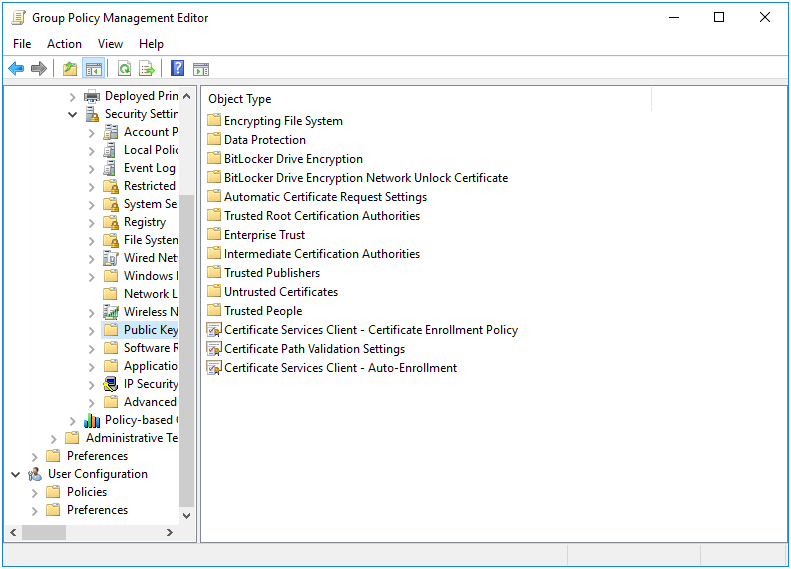
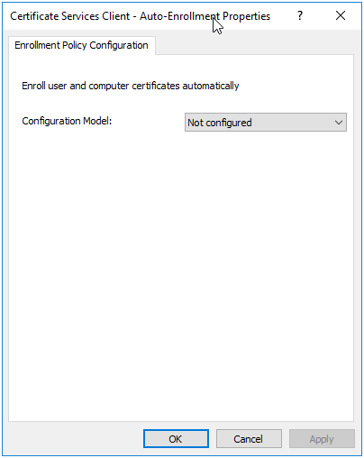
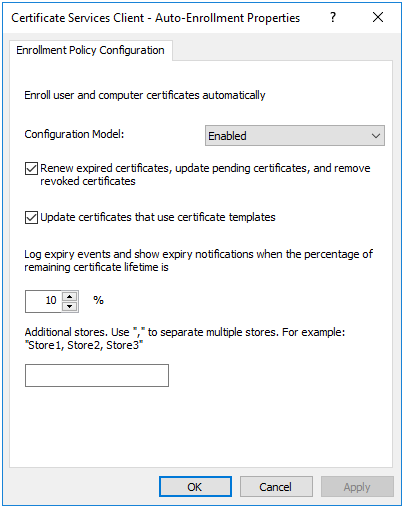
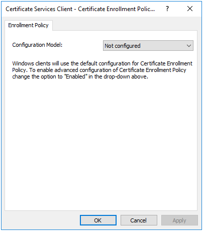

# Certificate Auto Enrollment Policy {#certautoenroll}

```{r, echo=FALSE, out.width="30%", fig.align='center'}
knitr::include_graphics("cert-auto-enroll-images/certificate.png")
```

Certificate Auto Enrollment allows devices to enroll for certificates from Active Directory Certificate Services. Samba’s Certificate Auto Enrollment uses the certmonger service to keep track of certificates. It also uses the cepces plugin to certmonger. The sscep command is also used to download the trust chain.

## Server Side Extension

The Server Side Extension (SSE) for Certificate Auto Enrollment is part of the Group Policy Management Editor (GPME). Currently, no `samba-tool` command is available for managing this policy. The policy requires access to a Windows certificate server. On the certificate server, the roles Certification Authority, Certificate Enrollment Policy Web Service, and Certificate Enrollment Web Service all must be installed and configured. Optionally the role Network Device Enrollment Service can be installed to simplify the fetching of the root certificate chain by the client. Configuring the certificate server is beyond the scope of this book.

### Managing Certificate Auto Enrollment via the GPME

Open the GPME and navigate to `Computer Configuration > Policies > Windows Settings > Security Settings > Public Key Policies`.



Double click on and open the `Certificate Services Client - Auto-Enrollment` properties.



Set the `Configuration Model` to Enabled, and check the boxes to enable `Renew expired certificates, update pending certificates, and remove revoked certificates` and `Update certificates that use certificate templates`.



Apply the changes and click OK to close the properties dialog. This has enabled simple Certificate Auto Enrollment. Next lets configure advanced Certificate Auto Enrollment. Open the `Certificate Services Client - Certificate Enrollment Policy` properties dialog (also under `Computer Configuration > Policies > Windows Settings > Security Settings > Public Key Policies` in the GPME).



Set the `Configuration Model` to Enabled. The default policy (configured previously in the `Certificate Services Client - Auto-Enrollment` properties dialog) is already listed under `Certificate enrollment policy list`. You can disable this policy if you choose, by unchecking the checkbox next to the item in the list. Click `Add...` to add additional certificate servers for Certificate Auto Enrollment to configure on the clients.


Fill in the enrollment policy server URI, and set the authentication type. `Windows integrated` authentication refers to Kerberos authentication. Setting a priority will effect the order in which the policy is applied to a client machine. When finished, click `Add`, then `Apply` in the properties dialog and OK to close.

## Client Side Extension

To setup Certificate Auto Enrollment:

1. Install certmonger and cepces. Optionally also install sscep to simplify fetching of the certificate root chain. Samba uses certmonger paired with cepces to monitor the host certificate templates.
2. Join to an Active Directory domain (one where the CA has been previously configured as explained above).
3. Enable group policy apply:
* For a Winbind joined machine by setting the smb.conf global parameter 'apply group policies = yes'.
* For a SSSD joined machine by installing the oddjob-gpupdate package.
4. To verify Certificate Auto Enrollment is correctly configured, issue the command `/usr/sbin/samba-gpupdate --rsop`
```
Resultant Set of Policy
Computer Policy

 GPO: Default Domain Policy
=================================================================
CSE: gp_cert_auto_enroll_ext
-----------------------------------------------------------
Policy Type: Auto Enrollment Policy
-----------------------------------------------------------
[ <REDACTED CA NAME> ] =
[ CA Certificate ] =
----BEGIN CERTIFICATE----
<REDACTED>
----END CERTIFICATE----
[ Auto Enrollment Server ] = <REDACTED DNS NAME>
[ Templates ] =
[ Machine ]
-----------------------------------------------------------
-----------------------------------------------------------
=================================================================
```

Issuing the `getcert list` command will display the installed certificates:
```
Number of certificates and requests being tracked: 1.
Request ID 'Machine':
        status: MONITORING
        stuck: no
        key pair storage: type=FILE,location='/var/lib/samba/private/certs/Machine.key'
        certificate: type=FILE,location='/var/lib/samba/certs/Machine.crt'
        CA: <My CA>
        issuer: CN=<My CA>
        subject: CN=<my hostname>
        expires: 2017-08-15 17:37:02 UTC
        dns: <my hostname>
        key usage: digitalSignature,keyEncipherment
        eku: id-kp-clientAuth,id-kp-serverAuth
        certificate template/profile: Machine
        pre-save command:
        post-save command:
        track: yes
        auto-renew: yes
```

### Where to find certificates

Certificates are installed in /var/lib/samba/certs and private keys are installed in /var/lib/samba/private/certs.
