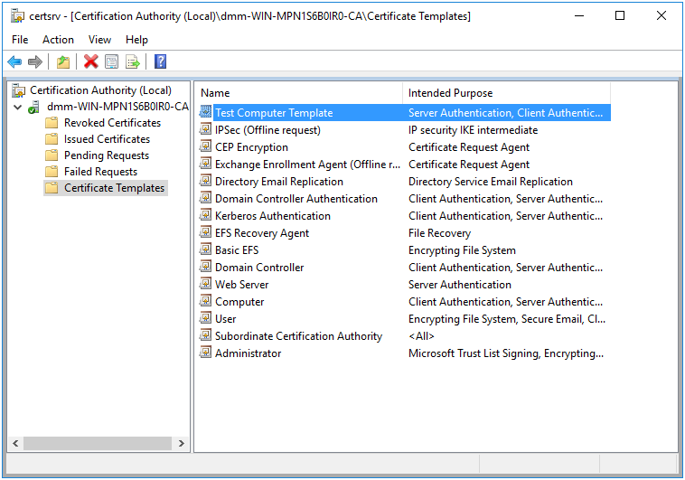

# Certificate Auto Enrollment Policy {#certautoenroll}

```{r, out.width="30%", echo=FALSE, fig.align='center'}
knitr::include_graphics("cert-auto-enroll-images/certificate.png")
```

Certificate Auto Enrollment allows devices to enroll for certificates from Active Directory Certificate Services. Samba’s Certificate Auto Enrollment uses the certmonger service to keep track of certificates. It also uses the cepces plugin to certmonger.

## Server Side Extension

The Server Side Extension (SSE) for Certificate Auto Enrollment is part of the Group Policy Management Editor (GPME). Currently, no `samba-tool` command is available for managing this policy. The policy requires access to a Windows certificate server. On the certificate server, the roles Certification Authority, Certificate Enrollment Policy Web Service, and Certificate Enrollment Web Service all must be installed and configured. Optionally the role Network Device Enrollment Service can be installed to simplify the fetching of the root certificate chain by the client. Configuring the certificate server is beyond the scope of this book.

Optionally, the Network Device Enrollment role can be configured on the server, which will allow the client to fetch the root certificate chain. Without this role, the Client Side Extension will report the following warnings:

```
[W26775]| Failed to fetch the root certificate chain. | {}
[W05621]| The Network Device Enrollment Service is either not
          installed or not configured. | {}
[W11946]| Installing the server certificate only. | {}
```

### Managing Certificate Auto Enrollment via the GPME

To enable Certificate Auto Enrollment using the Group Policy Management Editor (GPME):

1. Open the Group Policy Management Editor. For instructions on accessing the GPME, see chapter \@ref(manage) section \@ref(gpopen).

2. In the Group Policy Management Editor window, navigate to `Computer Configuration > Policies > Windows Settings > Security Settings > Public Key Policies`.

```{r, out.width="70%", echo=FALSE, fig.align='center', fig.pos = 'H', fig.cap = "Public Key Policies"}

```

3. Double click on and open the `Certificate Services Client - Auto-Enrollment` properties.

```{r, out.width="70%", echo=FALSE, fig.align='center', fig.pos = 'H', fig.cap = "Certificate Services Client - Auto-Enrollment"}
knitr::include_graphics("cert-auto-enroll-images/auto-enrollment.png")
```

4. In the properties dialog, set the `Configuration Model` to "Enabled" and check the boxes to enable `Renew expired certificates, update pending certificates, and remove revoked certificates` and `Update certificates that use certificate templates`.

```{r, out.width="70%", echo=FALSE, fig.align='center', fig.pos = 'H', fig.cap = "Enable Certificate Auto-Enrollment"}
knitr::include_graphics("cert-auto-enroll-images/auto-enrollment-enabled.png")
```

5. Click "Apply" to apply the changes and "OK" to close the properties dialog.

This has enabled simple Certificate Auto Enrollment. Next lets configure advanced Certificate Auto Enrollment.

Advanced Certificate Auto Enrollment allows you to add multiple certificate servers to your configuration. This is useful in a more complex environment with multiple certificate servers, but is not necessary in a simple environment with a single certificate server. The advanced configuration stores the policy directly on the SYSVOL in the Registry.pol file, whereas a simple configuration is stored in LDAP.

To configure Advanced Certificate Auto Enrollment:

1. In the Group Policy Management Editor window, navigate to `Computer Configuration > Policies > Windows Settings > Security Settings > Public Key Policies`.

2. Double-click on "Certificate Services Client - Certificate Enrollment Policy" to open its properties.

```{r, out.width="70%", echo=FALSE, fig.align='center', fig.pos = 'H', fig.cap = "Certificate Services Client - Certificate Enrollment Policy"}
knitr::include_graphics("cert-auto-enroll-images/advanced-config.png")
```

3. Set the `Configuration Model` to Enabled. The default policy (configured previously in the "Certificate Services Client - Auto-Enrollment" properties) should already be listed under "Certificate enrollment policy list." You can disable this policy if desired by unchecking the box next to the item in the list.

```{r, out.width="70%", echo=FALSE, fig.align='center', fig.pos = 'H', fig.cap = "Certificate Services Client - Certificate Enrollment Policy: Enabled"}
knitr::include_graphics("cert-auto-enroll-images/advanced-config-enabled.png")
```

4. To add additional certificate servers for Certificate Auto Enrollment, click "Add..."

```{r, out.width="70%", echo=FALSE, fig.align='center', fig.pos = 'H', fig.cap = "Add a Certificate Enrollment Policy Server"}
knitr::include_graphics("cert-auto-enroll-images/add-policy-server.png")
```

5. In the `Certificate Enrollment Policy Server` dialog, enter the enrollment policy server URI and set the authentication type. "Windows integrated" authentication refers to Kerberos authentication.

6. You can set a priority for the policy, which determines the order in which the policy is applied to a client machine.

7. When finished, click "Add" and then "Apply" in the properties dialog. Click "OK" to close the dialog.

### Certificate Templates

Certificate Templates instruct the client how to generate a certificate request for the Certificate Authority. These templates are configured using the `Certification Authority` utility included with the Remote Server Administration Tools (RSAT) found in Windows.

To create a certificate template:

1. Open the `Certification Authority` utility, and click on `Certificate Templates` in the tree.

```{r, out.width="70%", echo=FALSE, fig.align='center', fig.pos = 'H', fig.cap = "Certification Authority utility"}
knitr::include_graphics("cert-auto-enroll-images/certsrv.png")
```

2. Right click on `Certificates Templates` in the tree and select `Manage`.

3. You'll notice that there are a number of existing templates to choose from. Right click on one of the templates in the list, and click `Duplicate Template`.

```{r, out.width="70%", echo=FALSE, fig.align='center', fig.pos = 'H', fig.cap = "Certificate Templates Console"}

```

4. Switch to the `General` tab, and set a name for your new template.

5. Set the number of years the certificate will be valid and the renewal period.

```{r, out.width="70%", echo=FALSE, fig.align='center', fig.pos = 'H', fig.cap = "Template Properties"}

```

6. It may be useful to also review the `Cryptography` tab and ensure the cryptographic requirements for the certificate will meet the needs of your organization.

7. Apply and close the properties by clicking OK. Close the Certificate Templates Console

8. Next, to enable the new template, right click on `Certificate Templates` in the tree within the Certification Authority utility, and click `New > Certificate Template to Issue`.

9. In the `Enable Certificate Templates` dialog, select the template we just created, and click OK.

```{r, out.width="70%", echo=FALSE, fig.align='center', fig.pos = 'H', fig.cap = "Enable Certificate Templates"}

```

Our new template is now enabled, and should be in the list of enabled templates in the Certification Authority utility.

```{r, out.width="70%", echo=FALSE, fig.align='center', fig.pos = 'H', fig.cap = "Template Enabled"}

```

## Client Side Extension

The Certificate Auto Enrollment Client Side Extension (CSE) will add new Certificate Authorities to certmonger, and automatically request to track new certificates based on the assigned Certificate Templates. This CSE requires that the `certmonger` and `cepces` packages be installed.

Certificates will be installed in `/var/lib/samba/certs` and private keys in `/var/lib/samba/private/certs` by default. It may be necessary to configure a symlink policy, as explained in chapter \@ref(symlink), in order to link to a more appropriate location for these files.

Let’s list the Resultant Set of Policy to view the Certificate Auto Enrollment policy we created in the previous sections.

```
> sudo /usr/sbin/samba-gpupdate --rsop
Resultant Set of Policy
Computer Policy

GPO: Default Domain Policy
=================================================================
  CSE: gp_cert_auto_enroll_ext
  -----------------------------------------------------------
    Policy Type: Auto Enrollment Policy
    -----------------------------------------------------------
    [ lizardo-WIN-QLIPDP2ISN7-CA ] =
      [ CA Certificate ] =
-----BEGIN CERTIFICATE-----
<REDACTED>
-----END CERTIFICATE-----
      [ Auto Enrollment Server ] = WIN-QLIPDP2ISN7.lizardo.suse.de
      [ Templates ] =
        [ Machine ]
        [ TestComputerTemplate ]
    -----------------------------------------------------------
  -----------------------------------------------------------
=================================================================
```

Notice that the new template we created in the previous section is listed under the templates. The `Machine` template is also listed. This is a default template enabled for joined computers (this template was named `Computer` in the list of enabled templates we saw previously).

Let's now force an apply and observe the results.

```
> sudo /usr/sbin/samba-gpupdate --force
> sudo tdbdump /var/lib/samba/gpo.tdb -k "TESTSYSDM$" \
> | sed -r "s/\\\22/\"/g" | sed -r "s/\\\5C/\\\\/g" | xmllint --format -
<?xml version="1.0"?>
<gp>
  <user name="TESTSYSDM$">
    <guid value="{31B2F340-016D-11D2-945F-00C04FB984F9}">
      <gp_ext name="Cryptography\5CAutoEnrollment">
        <attribute name="bGl6YXJkby1XSU4tUUxJUERQMklTTjctQ0E=">{"files": ["/var/lib/samba/certs/lizardo-WIN-QLIPDP2ISN7-CA.crt", "/etc/pki/trust/anchors/lizardo-WIN-QLIPDP2ISN7-CA.crt", "/var/lib/samba/private/certs/lizardo-WIN-QLIPDP2ISN7-CA.Machine.key", "/var/lib/samba/certs/lizardo-WIN-QLIPDP2ISN7-CA.Machine.crt", "/var/lib/samba/private/certs/lizardo-WIN-QLIPDP2ISN7-CA.TestComputerTemplate.key", "/var/lib/samba/certs/lizardo-WIN-QLIPDP2ISN7-CA.TestComputerTemplate.crt"], "templates": ["lizardo-WIN-QLIPDP2ISN7-CA.Machine", "lizardo-WIN-QLIPDP2ISN7-CA.TestComputerTemplate"]}</attribute>
      </gp_ext>
    </guid>
    <applylog>
      <guid count="0" value="{31B2F340-016D-11D2-945F-00C04FB984F9}"/>
    </applylog>
  </user>
</gp>
```

The log details show that a number of files were created. Let's take a look at these files.

```
> sudo ls -lah /var/lib/samba/certs/
total 12K
drwxr-xr-x 1 root root  238 Dec  8 13:07 .
drwxr-xr-x 1 root root  396 Dec  8 13:07 ..
-rw-r--r-- 1 root root 1.4K Dec  8 13:07 lizardo-WIN-QLIPDP2ISN7-CA.crt
-rw------- 1 root root 2.0K Dec  8 13:07 lizardo-WIN-QLIPDP2ISN7-CA.Machine.crt
-rw------- 1 root root 2.1K Dec  8 13:07 lizardo-WIN-QLIPDP2ISN7-CA.TestComputerTemplate.crt
> sudo ls -lah /var/lib/samba/private/certs/
total 8.0K
drwx------ 1 root root  178 Dec  8 13:07 .
drwxr-xr-x 1 root root  112 Dec  8 13:07 ..
-rw------- 1 root root 1.7K Dec  8 13:07 lizardo-WIN-QLIPDP2ISN7-CA.Machine.key
-rw------- 1 root root 1.7K Dec  8 13:07 lizardo-WIN-QLIPDP2ISN7-CA.TestComputerTemplate.key
> sudo ls -lah /etc/pki/trust/anchors/
total 4.0K
drwxr-xr-x 1 root root 60 Dec  8 13:07 .
drwxr-xr-x 1 root root 50 Jun 14 21:17 ..
lrwxrwxrwx 1 root root 51 Dec  8 13:07 lizardo-WIN-QLIPDP2ISN7-CA.crt -> /var/lib/samba/certs/lizardo-WIN-QLIPDP2ISN7-CA.crt
```

The CSE download the root certificate from our CA (`lizardo-WIN-QLIPDP2ISN7-CA.crt`), and then linked it inside `/etc/pki/trust/anchors`. This is the system trust store. In addition to linking our CA root certificate to the trust store, the CSE also called the `update-ca-certificates` command to refresh the certificate store. Take a look at `man update-ca-certificates` for more details on how this works.

Now that we see our certificates have been installed, lets take a look at certmonger to see our CA and make sure our certificates are being auto-renewed.

```
> sudo getcert list-cas
CA 'lizardo-WIN-QLIPDP2ISN7-CA':
	is-default: no
	ca-type: EXTERNAL
	helper-location: /usr/libexec/certmonger/cepces-submit --server=WIN-QLIPDP2ISN7.lizardo.suse.de --auth=Kerberos
> sudo getcert list
Number of certificates and requests being tracked: 2.
Request ID 'lizardo-WIN-QLIPDP2ISN7-CA.Machine':
	status: MONITORING
	stuck: no
	key pair storage: type=FILE,location='/var/lib/samba/private/certs/lizardo-WIN-QLIPDP2ISN7-CA.Machine.key'
	certificate: type=FILE,location='/var/lib/samba/certs/lizardo-WIN-QLIPDP2ISN7-CA.Machine.crt'
	CA: lizardo-WIN-QLIPDP2ISN7-CA
	issuer: CN=lizardo-WIN-QLIPDP2ISN7-CA,DC=lizardo,DC=suse,DC=de
	subject: CN=testsysdm.lizardo.suse.de
	issued: 2022-12-08 12:57:35 MST
	expires: 2023-12-08 12:57:35 MST
	dns: testsysdm.lizardo.suse.de
	key usage: digitalSignature,keyEncipherment
	eku: id-kp-clientAuth,id-kp-serverAuth
	certificate template/profile: Machine
	profile: Machine
	pre-save command: 
	post-save command: 
	track: yes
	auto-renew: yes
Request ID 'lizardo-WIN-QLIPDP2ISN7-CA.TestComputerTemplate':
	status: MONITORING
	stuck: no
	key pair storage: type=FILE,location='/var/lib/samba/private/certs/lizardo-WIN-QLIPDP2ISN7-CA.TestComputerTemplate.key'
	certificate: type=FILE,location='/var/lib/samba/certs/lizardo-WIN-QLIPDP2ISN7-CA.TestComputerTemplate.crt'
	CA: lizardo-WIN-QLIPDP2ISN7-CA
	issuer: CN=lizardo-WIN-QLIPDP2ISN7-CA,DC=lizardo,DC=suse,DC=de
	subject: 
	issued: 2022-12-08 12:57:35 MST
	expires: 2023-12-08 12:57:35 MST
	dns: testsysdm.lizardo.suse.de
	key usage: digitalSignature,keyEncipherment
	eku: id-kp-serverAuth,id-kp-clientAuth
	profile: TestComputerTemplate
	pre-save command: 
	post-save command: 
	track: yes
	auto-renew: yes
```

We see that certmonger is aware of our CA, and is tracking the template we created, and also the default Machine template. The status on your certificates should say `MONITORING`, as it does here. If not, then you'll need to do some investigation to see why.

### Trouble Shooting Certificates

If your certificates are not listed with a `MONITORING` status in `getcert list`, then you can start trouble shooting by rerunning `sudo /usr/sbin/samba-gpupdate --force`. Look for any errors in the output that could indicate what caused the problem. For example, a common error you'll encounter is `Failed to fetch the list of supported templates`. This error comes with a detailed backtrace. Look for the `Caused by` message.

#### Certificate doesn't match

This particular error happens when Internet Information Services (IIS) has the wrong root certificate selected.

```
(Caused by SSLError(CertificateError("hostname \'win-qlipdp2isn7.lizardo.suse.de\' doesn\'t match \'lizardo-WIN-QLIPDP2ISN7-CA\'")))
```

To resolve this error, open the IIS Manager, select the Default Web Site in the tree, then click `Bindings` in the right side `Actions` pane.

```{r, out.width="70%", echo=FALSE, fig.align='center', fig.pos = 'H', fig.cap = "IIS Manager"}
knitr::include_graphics("cert-auto-enroll-images/bindings.png")
```

Highlight the https binding, then select `Edit...`. Select the correct SSL certificate, then click OK to save.

```{r, out.width="70%", echo=FALSE, fig.align='center', fig.pos = 'H', fig.cap = "Edit Site Binding"}
knitr::include_graphics("cert-auto-enroll-images/edit-binding.png")
```

#### python-requests security level

Another error you may enounter is actually specific to the *python-requests* module.

```
(Caused by SSLError(SSLError(1, '[SSL: DH_KEY_TOO_SMALL] dh key too small (_ssl.c:852)'),))
```

This `DH_KEY_TOO_SMALL` error is caused by a default security level change in *python-requests*. You can work around this error by setting `openssl_seclevel=1` in the **global** section of your `cepces.conf`.

#### Checking request failures

If the CA failed to issue a certificate when the template request was sent, we can check the Certification Authority utility to see why a request was rejected. If you click in the tree, there are lists of `Failed Requests`, `Pending Requests`, `Issued Certificates`, and `Revoked Certificates`. If your request failed for some reason, it may show up under `Failed Requests`, for example.

```{r, out.width="70%", echo=FALSE, fig.align='center', fig.pos = 'H', fig.cap = "Issued Certificates"}
knitr::include_graphics("cert-auto-enroll-images/issued-certs.png")
```

You can see, for example, in the `Issued Certificates` list, that the certificates we are monitoring on our test machine are listed here (the two most recent requests).

#### Examining logs

Check the logs to track down other issues. The *cepces* plugin logs to `/var/log/cepces/cepces.log` by default. Check the **handler_fileHandler** section of `/etc/cepces/logging.conf` for the exact location of the log. Additionally, some errors may end up in the *certmonger* logs, instead of *cepces*. You can check `journalctl -xe -t certmonger` for *certmonger* messages.
