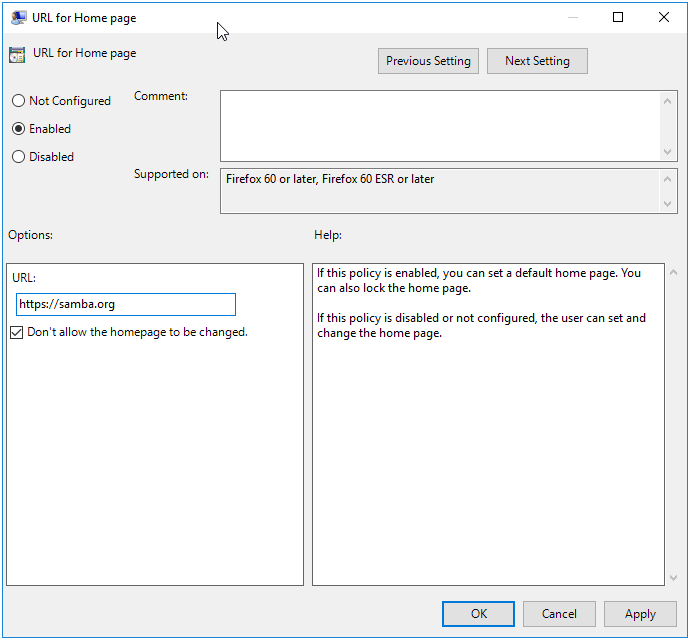

# Firefox Policy {#firefox}

```{r, echo=FALSE, out.width="30%", fig.align='center'}
knitr::include_graphics("firefox-images/browse.png")
```

Firefox Policy deploys a `policies.json` file to client machines to customize how Firefox looks and operates.

This policy is physically stored on the SYSVOL in **MACHINE/Registry.pol**. It is stored in registry format. See chapter \@ref(regpol) for details on how to manually modify this file.

## Server Side Extension

The Server Side Extension (SSE) for Firefox Policy is distributed via Administrative Templates (see chapter \@ref(sse) in section \@ref(admx)). This SSE uses the admx templates provided by Mozilla.

Setting up the ADMX templates for this policy is described in chapter \@ref(install-admx) section \@ref(install-admx-firefox).

## Managing Firefox Policy via the GPME

Open the GPME and navigate to `Computer Configuration > Administrative Templates > Mozilla > Firefox`.

```{r, out.width="70%", echo=FALSE, fig.align='center', fig.pos = 'H', fig.cap = "Mozilla Administrative Templates"}
knitr::include_graphics("firefox-images/gpme.png")
```

There are many options to choose from, but for this example we'll just test setting a homepage. Click on `Home page` in the tree, and we're going to modify both the `Start Page` and the `URL for Home page`.

```{r, out.width="70%", echo=FALSE, fig.align='center', fig.pos = 'H', fig.cap = "Start Page"}
knitr::include_graphics("firefox-images/start-page.png")
```

First we'll set the `Start Page` to `Homepage (Locked)`. This requires the start page to always open the homepage, and the user will be unable to change it to point anywhere else.

```{r, out.width="70%", echo=FALSE, fig.align='center', fig.pos = 'H', fig.cap = "Home Page"}

```

Next we'll set the homepage URL, and check the box `Don't allow the homepage to be changed`. This will prevent the user from changing the homepage.

::: {#info style="color: green;"}
Note that when setting a home page, you *MUST* include the http or https prefix, or Firefox will ignore the policy.
:::

## Client Side Extension

The Firefox Client Side Extension (CSE) creates 2 policy files. One at `/usr/lib64/firefox/distribution/policies.json` and the other at `/etc/firefox/policies/policies.json`. These files will contain exactly the same information. The only reason there is a duplicate, is because different versions of Firefox require the policy file in different locations.

Let’s list the Resultant Set of Policy to view policies we set in the previous section.

```
> sudo /usr/sbin/samba-gpupdate --rsop
Resultant Set of Policy
Computer Policy

GPO: Default Domain Policy
=================================================================
  CSE: gp_firefox_ext
  -----------------------------------------------------------
    Policy Type: Software\Policies\Mozilla\Firefox\Homepage\StartPage
    -----------------------------------------------------------
      homepage-locked
    -----------------------------------------------------------
    Policy Type: Software\Policies\Mozilla\Firefox\Homepage\URL
    -----------------------------------------------------------
      https://samba.org
    -----------------------------------------------------------
    Policy Type: Software\Policies\Mozilla\Firefox\Homepage\Locked
    -----------------------------------------------------------
      1
    -----------------------------------------------------------
  -----------------------------------------------------------
=================================================================
```

We see that the policy we set is listed. Next let's force an apply of the policy, and see what is logged in the Group Policy Cache.

```
> sudo /usr/sbin/samba-gpupdate --force
> sudo tdbdump /var/lib/samba/gpo.tdb -k "TESTSYSDM$" \
 | sed -r "s/\\\22/\"/g" | sed -r "s/\\\5C/\\\\/g" \
 | xmllint --xpath "//gp_ext[@name='Mozilla/Firefox']" - \
 | xmllint --format -
<gp_ext name="Mozilla/Firefox">
  <attribute name="policies.json">
    {"policies": {}}
  </attribute>
</gp_ext>
```

There isn't much interesting in the cache, since it just tells us that we had no policies set previously. Let's look inside our policy file and see what was applied.

```
> npx prettier /etc/firefox/policies/policies.json
{
  "policies": {
    "Homepage": {
      "StartPage": "homepage-locked",
      "URL": "https://samba.org",
      "Locked": true
    }
  }
}
```

It appears that our policies are applied. Opening Firefox, we see that the policy is being enforced.

```{r, out.width="70%", echo=FALSE, fig.align='center', fig.pos = 'H', fig.cap = "Firefox"}

```

If you open your browser settings, you'll notice a warning message indicating that your organization is managing the browser. If Firefox encountered any problems enforcing the policy, a warning will be listed here.

```{r, out.width="70%", echo=FALSE, fig.align='center', fig.pos = 'H', fig.cap = "Managed Firefox"}

```

Notice that the homepage settings are now grayed out in the settings dialog, and can't be modified by the user.
