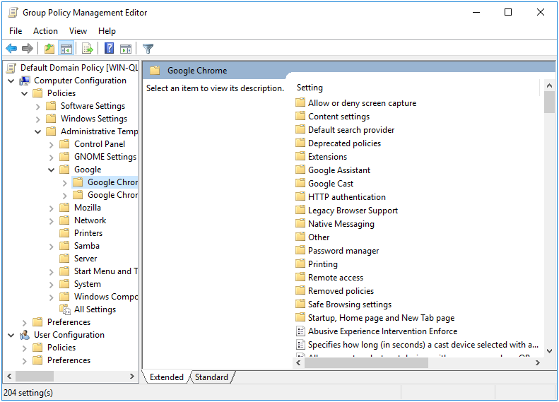
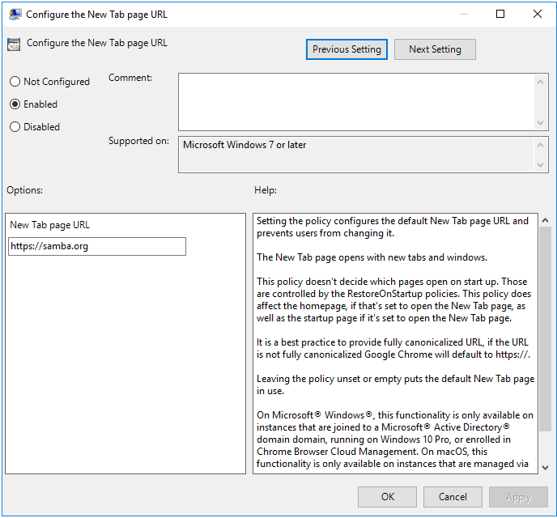
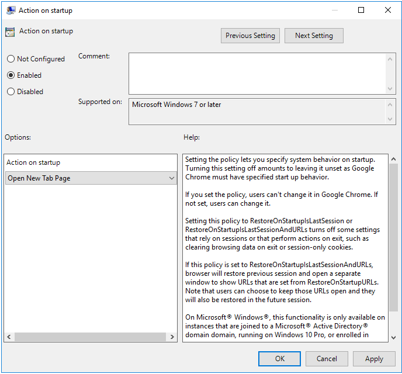
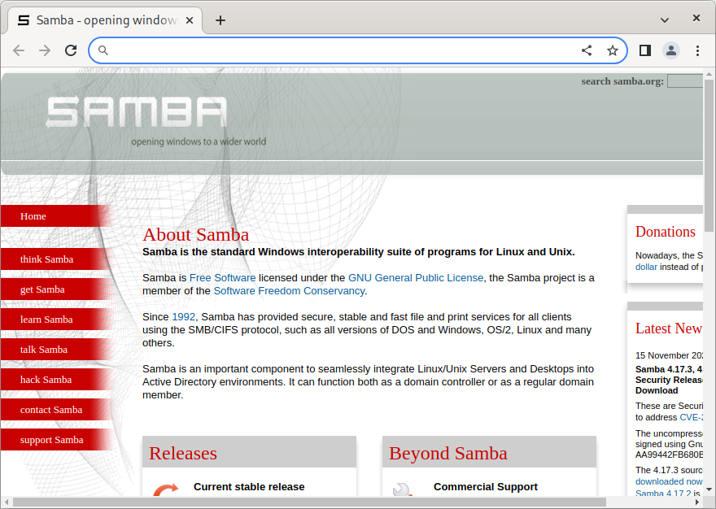
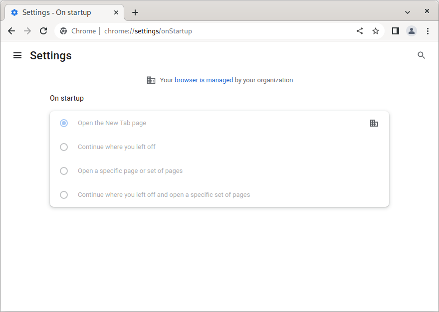

# Chromium/Chrome Policy {#chrome}

```{r, echo=FALSE, out.width="30%", fig.align='center'}

```

\index{Policies!Chromium/Chrome}

Chromium Policy deploys a json file to client machines to customize how the browser looks and operates.

This policy is physically stored on the SYSVOL in **MACHINE/Registry.pol**. It is stored in registry format. See chapter \@ref(regpol) for details on how to manually modify this file.

## Server Side Extension

The Server Side Extension (SSE) for Chromium Policy is distributed via Administrative Templates (see chapter \@ref(sse) in section \@ref(admx)). This SSE uses the admx templates provided by Google. See https://support.google.com/chrome/a/answer/187202 for the latest release of Google's templates.

Setting up the ADMX templates for this policy is described in chapter \@ref(install-admx) section \@ref(install-admx-chromium).
\index{Server Side Extensions}
\index{Administrative Templates}

### Managing Chromium Policy via the GPME

Open the GPME and navigate to `Computer Configuration > Administrative Templates > Google`.

```{r, out.width="70%", echo=FALSE, fig.align='center', fig.pos = 'H', fig.cap = "Google Administrative Templates"}

```

You'll notice that there are two sections for Chrome, titled `Google Chrome` and `Google Chrome - Default Settings (users can override)`. The settings in `Google Chrome` will always be enforced. The settings in `Default Settings` will be distributed, but will not be enforced (users can modify these).

For this example, let's enforce a homepage. Select `Google Chrome > Startup, Home page and New Tab page`. First, let's set the `New Tab Page as homepage` option, forcing our homepage choice to load when we first open a Chromium tab.

```{r, out.width="70%", echo=FALSE, fig.align='center', fig.pos = 'H', fig.cap = "Use New Tab Page as homepage"}
knitr::include_graphics("chrome-images/tab-page.png")
```

Next, let's set the new tab page URL.

```{r, out.width="70%", echo=FALSE, fig.align='center', fig.pos = 'H', fig.cap = "Configure the New Tab page URL"}

```

Finally, let's tell Chromium to default to the New Tab Page when first opening.

```{r, out.width="70%", echo=FALSE, fig.align='center', fig.pos = 'H', fig.cap = "Action on startup"}

```

## Client Side Extension

Chromium policy comes with 2 Client Side Extensions (CSEs), which generate a total of 4 policy files. Each CSE generates a `managed` policy file (these policies are enforced), and a `recommended` policy file (these policies are set but not enforced). The generated json files can be found in `/etc/chromium/policies/managed`, `/etc/chromium/policies/recommended`, `/etc/opt/chrome/policies/managed`, and `/etc/opt/chrome/policies/recommended`.
\index{Client Side Extensions}

Let’s list the Resultant Set of Policy to view policies we set in the previous section.

```
> sudo /usr/sbin/samba-gpupdate --rsop
Resultant Set of Policy
Computer Policy

GPO: Default Domain Policy
=================================================================
  CSE: gp_chromium_ext
  -----------------------------------------------------------
    Policy Type: Software\Policies\Google\Chrome\
                 HomepageIsNewTabPage
    -----------------------------------------------------------
      1
    -----------------------------------------------------------
    Policy Type: Software\Policies\Google\Chrome\
                 NewTabPageLocation
    -----------------------------------------------------------
      https://samba.org
    -----------------------------------------------------------
    Policy Type: Software\Policies\Google\Chrome\
                 RestoreOnStartup
    -----------------------------------------------------------
      5
    -----------------------------------------------------------
  -----------------------------------------------------------
  CSE: gp_chrome_ext
  -----------------------------------------------------------
    Policy Type: Software\Policies\Google\Chrome\
                 HomepageIsNewTabPage
    -----------------------------------------------------------
      1
    -----------------------------------------------------------
    Policy Type: Software\Policies\Google\Chrome\
                 NewTabPageLocation
    -----------------------------------------------------------
      https://samba.org
    -----------------------------------------------------------
    Policy Type: Software\Policies\Google\Chrome\
                 RestoreOnStartup
    -----------------------------------------------------------
      5
    -----------------------------------------------------------
  -----------------------------------------------------------
=================================================================
```
\index{Resultant Set of Policy}

Notice that the policy which will be applied for Chrome and Chromium are identical. This is because each CSE is reading from the same policy. Let's now force a policy apply, and see what is logged in the Group Policy Cache.

```
> sudo /usr/sbin/samba-gpupdate --force
> sudo tdbdump /var/lib/samba/gpo.tdb -k "TESTSYSDM$" \
 | sed -r "s/\\\22/\"/g" | sed -r "s/\\\5C/\\\\/g" \
 | xmllint --xpath "//gp_ext[@name='Google/Chromium' or
                             @name='Google/Chrome']" - \
 | xmllint --format -
<gp_ext name="Google/Chromium">
  <attribute name="recommended">
    9327...d13f:
      /etc/chromium/policies/recommended/gp_g4_82tuo.json
  </attribute>
  <attribute name="managed">
    d452...1935:
      /etc/chromium/policies/managed/gp_l_k9uvxk.json
  </attribute>
</gp_ext>
<gp_ext name="Google/Chrome">
  <attribute name="recommended">
    9327...d13f:
      /etc/opt/chrome/policies/recommended/gp_7p6q0bxf.json
  </attribute>
  <attribute name="managed">
    d452...1935:
      /etc/opt/chrome/policies/managed/gp_fcthg4bc.json
  </attribute>
</gp_ext>
```

Our cache shows that 4 json policies were created in the directories where we expected them. Let's look at the contents.
\index{Group Policy Cache}

```
> npx prettier /etc/chromium/policies/recommended/gp_g4_82tuo.json
{}
> npx prettier /etc/chromium/policies/managed/gp_l_k9uvxk.json
{
  "HomepageIsNewTabPage": true,
  "NewTabPageLocation": "https://samba.org",
  "RestoreOnStartup": 5
}
> npx prettier /etc/opt/chrome/policies/recommended/gp_7p6q0bxf.json
{}
> npx prettier /etc/opt/chrome/policies/managed/gp_fcthg4bc.json
{
  "HomepageIsNewTabPage": true,
  "NewTabPageLocation": "https://samba.org",
  "RestoreOnStartup": 5
}
```

As expected, the `recommended` policy files are empty, since we only set `managed` policy. The `managed` is what we expected. Let's now open Chrome, and check that the policy was applied.

```{r, out.width="70%", echo=FALSE, fig.align='center', fig.pos = 'H', fig.cap = "Chrome with default homepage"}

```

If you now open the browser settings, you'll see a warning indicating that your browser is being managed by your organization.

```{r, out.width="70%", echo=FALSE, fig.align='center', fig.pos = 'H', fig.cap = "Chrome settings"}

```

Notice that the `On startup` options have been grayed out. Had we not set the `Action on startup`, the user would still be able to modify the startup options, and avoid the default homepage we just set.
