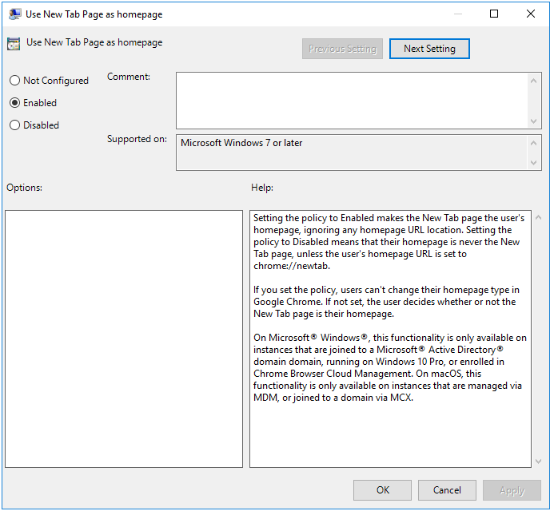

# Chromium/Chrome Policy {#chrome}

```{r, echo=FALSE, out.width="30%", fig.align='center'}
knitr::include_graphics("chrome-images/space.png")
```

Chromium Policy deploys a json file to client machines to customize how the browser looks and operates.

This policy is physically stored on the SYSVOL in **MACHINE/Registry.pol**. It is stored in registry format. See chapter \@ref(regpol) for details on how to manually modify this file.

## Server Side Extension

The Server Side Extension (SSE) for Chromium Policy is distributed via Administrative Templates (see chapter \@ref(sse) in section \@ref(admx)). This SSE uses the admx templates provided by Google. See https://support.google.com/chrome/a/answer/187202 for the latest release of Google's templates.

Setting up the ADMX templates for this policy is described in chapter \@ref(install-admx) section \@ref(install-admx-chromium).

### Managing Chromium Policy via the GPME

Open the GPME and navigate to `Computer Configuration > Administrative Templates > Google`.


You'll notice that there are two sections for Chrome, titled `Google Chrome` and `Google Chrome - Default Settings (users can override)`. The settings in `Google Chrome` will always be enforced. The settings in `Default Settings` will be distributed, but will not be enforced (users can modify these).

For this example, let's enforce a homepage. Select `Google Chrome > Startup, Home page and New Tab page`. First, let's set the `New Tab Page as homepage` option, forcing our homepage choice to load when we first open a Chromium tab.



Next, let's set the home page URL.


Finally, let's tell Chromium to default to the New Tab Page when first opening.


## Client Side Extension
