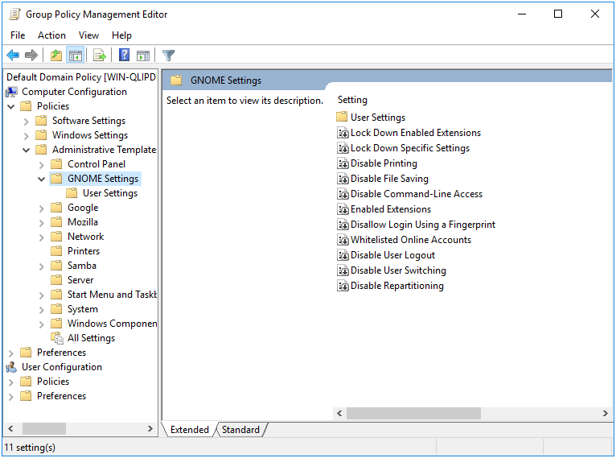
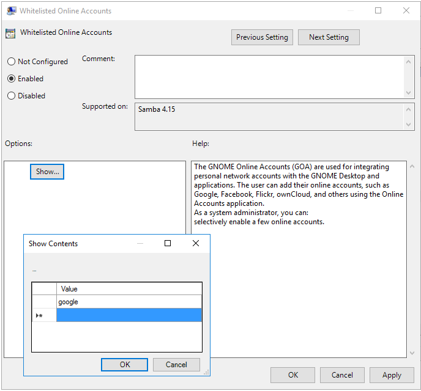
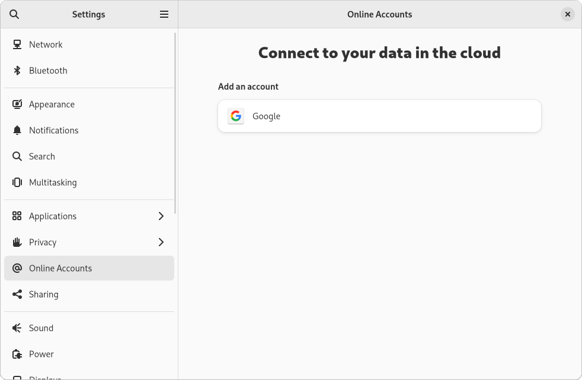

# GNOME Settings Policy {#gnome}

```{r, echo=FALSE, out.width="30%", fig.align='center'}

```

The GNOME Settings Policy deploys dconf settings that control the desktop experience. These settings correspond to those defined in the GNOME System Administration Guide found at https://help.gnome.org/admin/system-admin-guide/stable/user-settings.html.en.

This policy is physically stored on the SYSVOL in **MACHINE/Registry.pol**. It is stored in registry format. See chapter \@ref(regpol) for details on how to manually modify this file.

## Server Side Extension

The Server Side Extension (SSE) for Chromium Policy is distributed via Administrative Templates (see chapter \@ref(sse) in section \@ref(admx)). Setting up the ADMX templates for this policy is described in chapter \@ref(install-admx) section \@ref(install-admx-samba).

### Managing GNOME Settings Policy via the GPME

Open the GPME and navigate to `Computer Configuration > Administrative Templates > GNOME Settings`.

```{r, out.width="70%", echo=FALSE, fig.align='center', fig.pos = 'H', fig.cap = "GNOME Settings Administrative Templates"}

```

Let's set the allowed online accounts, which will effect the `Online Accounts` list in the GNOME Settings Dialog.

```{r, out.width="70%", echo=FALSE, fig.align='center', fig.pos = 'H', fig.cap = "Whitelisted Online Accounts"}

```

## Client Side Extension

The GNOME Settings Client Side Extension (CSE) creates various `dconf` files to deploy the policy. After creating these policy files, the CSE executes `dconf update` to apply the new policy. Users will need to log out and back in again in order for these policies to take effect.

Let's list the Resultant Set of Policy and view the lockdown settings we've set.

```
> sudo /usr/sbin/samba-gpupdate --rsop
Resultant Set of Policy
Computer Policy

GPO: Default Domain Policy
=================================================================
  CSE: gp_gnome_settings_ext
  -----------------------------------------------------------
    Policy Type: Whitelisted Online Accounts
    -----------------------------------------------------------
    [ google ]
    -----------------------------------------------------------
  -----------------------------------------------------------
=================================================================
```

Next let’s force an apply of the policy, and see what is logged in the Group Policy Cache.

```
> sudo /usr/sbin/samba-gpupdate --force
> sudo tdbdump /var/lib/samba/gpo.tdb -k "TESTSYSDM$" \
 | sed -r "s/\\\22/\"/g" | sed -r "s/\\\5C/\\\\/g" \
 | xmllint --xpath "//gp_ext[@name='GNOME Settings/
                                    Lock Down Settings']" - \
 | xmllint --format -
<gp_ext name="GNOME Settings/Lock Down Settings">
  <attribute name="Whitelisted Online Accounts">
    /etc/dconf/db/local.d/0000000001-goa;
    /etc/dconf/db/local.d/locks/0000000001-goa
  </attribute>
</gp_ext>
```

Checking the contents of the files, we see that our whitelisted provider is set, and that the policy is locked (which prevents user modification).

```
> cat /etc/dconf/db/local.d/0000000001-goa
[org/gnome/online-accounts]
whitelisted-providers = ['google']
> cat /etc/dconf/db/local.d/locks/0000000001-goa; echo
/org/gnome/online-accounts/whitelisted-providers
```

We can also check the dconf output to see that the setting is applied.

```
> dconf dump / \
 | grep -E "(whitelisted-providers|org/gnome/online-accounts)"
[org/gnome/online-accounts]
whitelisted-providers=['google']
```

Recall that it's necessary to log the user out and back in again. After which, we can check the GNOME Settings dialog and see that `Online Accounts` are restricted as requested.

```{r, out.width="70%", echo=FALSE, fig.align='center', fig.pos = 'H', fig.cap = "Online Accounts"}

```
