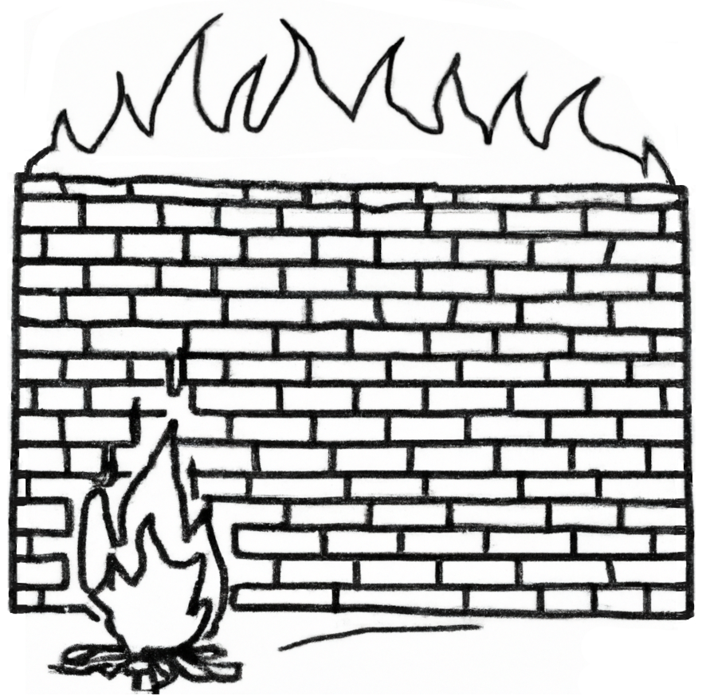
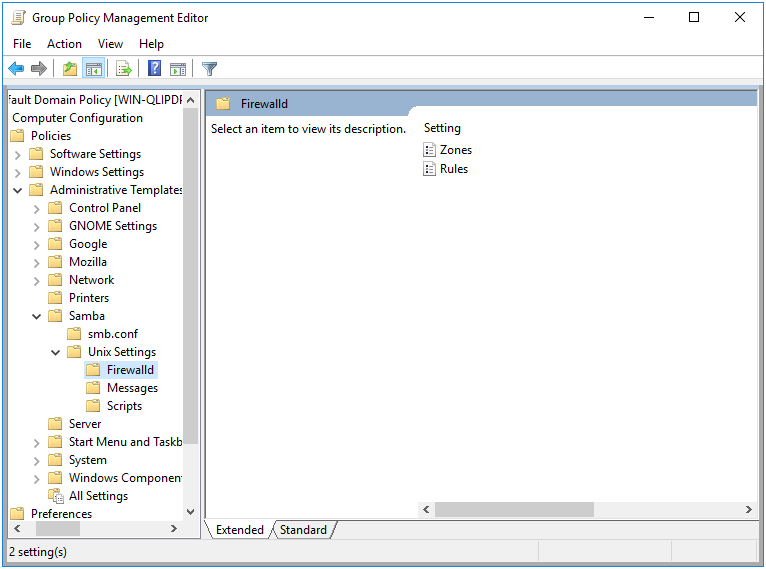
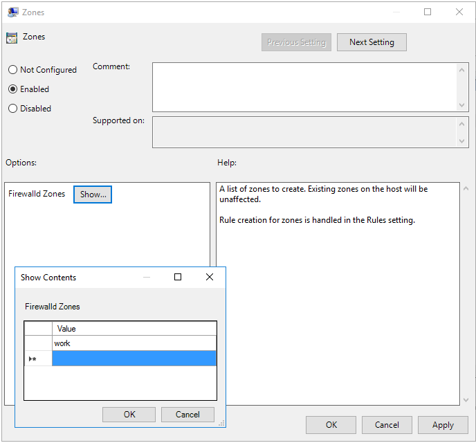
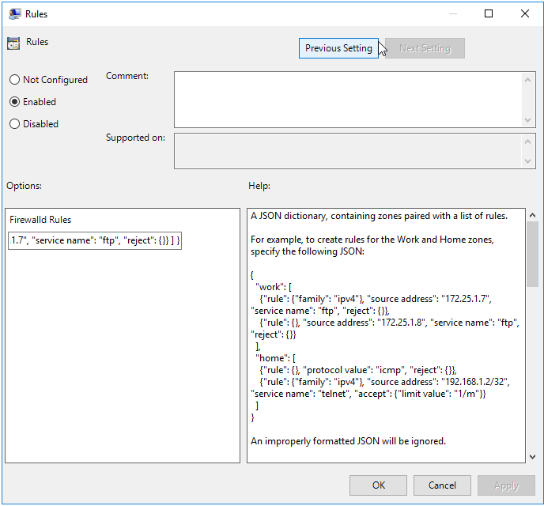

# Firewalld Policy {#firewalld}

```{r, echo=FALSE, out.width="30%", fig.align='center'}

```

The purpose of the Firewalld Policy is to apply firewalld rules to the client machine.

This policy is physically stored on the SYSVOL in the **MACHINE/Registry.pol** file within the subdirectory of the Group Policy Object. It is stored in registry format. See chapter \@ref(regpol) for details on how to manually modify this file.

## Server Side Extension

The Server Side Extension (SSE) for the Firewalld Policy is distributed using Administrative Templates (ADMX). Refer to chapter \@ref(sse) in section \@ref(admx) for details about Administrative Templates.

Setting up the ADMX templates for this policy is described in chapter \@ref(install-admx) section \@ref(install-admx-samba).

### Managing Firewalld Policy via the GPME

Open the Group Policy Management Editor (GPME) and navigate to `Computer Configuration > Policies > Administrative Templates > Samba > Unix Settings > Firewalld`.



You can see we have the options to create firewall rules, and firewall zones. For this example, we're going to create a single rule in a new zone named "work".



We'll define our new rule as follows.

```json
{ "work":
  [
    {
      "rule": { "family": "ipv4"},
      "source address": "172.25.1.7",
      "service name": "ftp",
      "reject": {}
    }
  ]
}
```



#### Firewalld Policy Rule Definitions

The policy provides for the creation of rules and zones. Zones are defined as a list in the Zones setting in the Firewalld policy. Existing zones on the host will be unaffected.

Rules are defined using a JSON dictionary, containing zones paired with a list of rules.

For example, to create rules for the Work and Home zones, specify the following JSON:

```json
 {
   "work": [
     {"rule": {"family": "ipv4"}, "source address": "172.25.1.7", "service name": "ftp", "reject": {}},
     {"rule": {}, "source address": "172.25.1.8", "service name": "ftp", "reject": {}}
   ],
   "home": [
     {"rule": {}, "protocol value": "icmp", "reject": {}},
     {"rule": {"family": "ipv4"}, "source address": "192.168.1.2/32", "service name": "telnet", "accept": {"limit value": "1/m"}}
   ]
 }
```

The rule structure loosely follows the Firewalld Rich Language Documentation. The general rule structure follows.

```json
{
   "rule": {
     "family": "ipv4 | ipv6",
     "priority": "priority"
   },
   "source [not] address | mac | ipset": "address[/mask] | mac-address | ipset",
   "destination [not] adress": "address[/mask]",
   "service name": "service name",
   "port": {
     "port": "port value",
     "protocol": "tcp | udp"
   }
   "protocol value": "protocol value",
   "icmp-block name": "icmptype name",
   "Masquerade": true|false,
   "icmp-type": "icmptype name",
   "forward-port": {
     "port": "port value",
     "protocol": "tcp | udp",
     "to-port": "port value",
     "to-addr": "address"
   },
   "source-port": {
     "port": "port value",
     "protocol": "tcp | udp"
   },
   "log": {
     "prefix": "prefix text",
     "level": "emerg | alert | crit | error | warning | notice | info | debug",
     "limit value": "rate/duration"
   },
   "audit": {
     "limit value": "rate/duration"
   },
   "accept" : {
     "limit value": "rate/duration"
   } | "reject": {
     "type": "reject type",
     "limit value": "rate/duration"
   } | "drop": {
     "limit value": "rate/duration"
   } | "mark": {
     "set": "mark[/mask]",
     "limit value": "rate/duration"
   }
 }
```

## Client Side Extension

The Firewalld Client Side Extension (CSE) accepts the rules specified by the SSE, and applies them using the firewalld command `firewall-cmd`. For example, new zones are added using the `firewall-cmd --permanent --new-zone=work` command. New firewall rules are added using the `firewall-cmd --permanent --zone=work --add-rich-rule 'rule family=ipv4 source address=172.25.1.7 service name=ftp reject'`.

Let's check the Resultant Set of Policy on our Linux client.

```
> sudo /usr/sbin/samba-gpupdate --rsop
[sudo] password for root: 
Resultant Set of Policy
Computer Policy

GPO: Default Domain Policy
=================================================================
  CSE: gp_firewalld_ext
  -----------------------------------------------------------
    Policy Type: Rules
    -----------------------------------------------------------
    [ 
      [ work ] = 
        [ 
          [ rule ] = 
            [ family ] = ipv4
          [ source address ] = 172.25.1.7
          [ service name ] = ftp
          [ reject ] = 
        ]
    ]
    -----------------------------------------------------------
    Policy Type: Zones
    -----------------------------------------------------------
    [ work ]
    -----------------------------------------------------------
  -----------------------------------------------------------
=================================================================
```

Let’s now force an apply, and verify that rule gets applied.

```
> sudo /usr/sbin/samba-gpupdate --force
> sudo tdbdump /var/lib/samba/gpo.tdb -k "TESTSYSDM$" \
> | sed -r "s/\\\22/\"/g" | sed -r "s/\\\5C/\\\\/g" | xmllint --format -
<?xml version="1.0"?>
<gp>
  <user name="TESTSYSDM$">
    <guid value="{31B2F340-016D-11D2-945F-00C04FB984F9}">
      <gp_ext name="Security/Firewalld">
        <attribute name="rule:work:f4802306893de59d239b58743e101b65fe941fcf8d1e5a51fd107bc7282caa73db379ba7720cb4393f2318289998a677365089db7b136c671a5385ca6ba0e3a8">rule family=ipv4 source address=172.25.1.7 service name=ftp reject  </attribute>
      </gp_ext>
    </guid>
    <applylog>
      <guid count="0" value="{31B2F340-016D-11D2-945F-00C04FB984F9}"/>
    </applylog>
  </user>
</gp>
```

Unfortunately, at the time of this writing, `firewall-cmd` appears to be unable to list installed rich rules. We can verify that our rule has applied though by trying to apply it again.

```
> sudo firewall-cmd --permanent --zone=work --add-rich-rule 'rule family=ipv4 source address=172.25.1.7 service name=ftp reject'
Warning: ALREADY_ENABLED: rule family=ipv4 source address=172.25.1.7 service name=ftp reject
success
```

Attempting to add the rule, we can see that firewalld warns us that the rule is already enabled.
