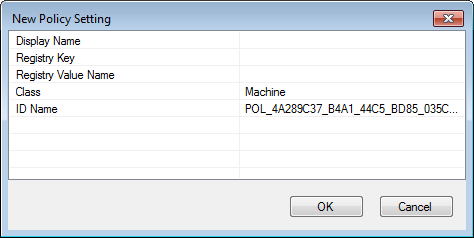
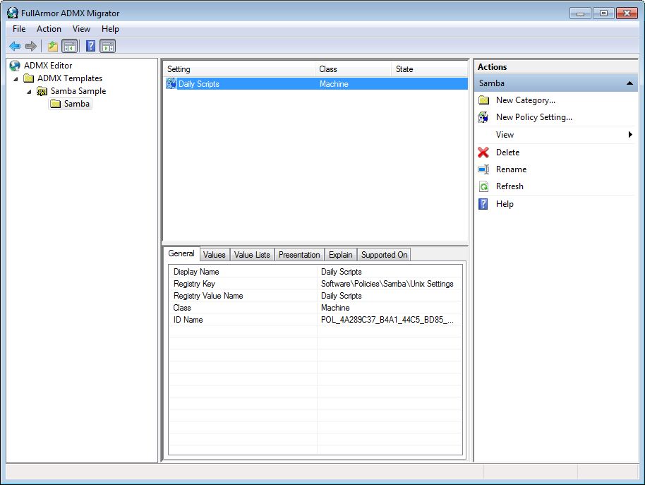

# Writing Group Policy Extensions

The chapter will explain how to write a Group Policy Extension for Samba's Winbind. Group Policy is a delivery mechanism for distributing system settings and company policies to machines joined to an Active Directory domain. Unix/Linux machines running Samba's Winbind can also deploy these policies.

## Creating the Server Side Extension {#sse}

### Administrative Templates {#admx}

The first step to deploying Group Policy is to create a Server Side Extension (SSE). There are multiple ways to create an SSE, but here we'll only discuss Administrative Templates (ADMX). The purpose of the SSE is to deploy policies to the SYSVOL share. Theoretically, you could manually deploy any file (even plain text) to the SYSVOL and then write a Client Side Extension that parses it, but ADMX can be read and modified by the Group Policy Management Editor, which makes administration of policies simpler.

ADMX files are simply XML files which explain to the Group Policy Management Console how to display and store a policy in the SYSVOL. AMDX files always store policies in Registry.pol files. Samba provides a mechanism for parsing these, which we'll discuss later.

Below is a simple example of an ADMX template, and it's corresponding ADML file.

**samba.admx:**

```xml
<policyDefinitions revision="1.0" schemaVersion="1.0">
  <policyNamespaces>
    <target prefix="fullarmor" namespace="FullArmor.Policies.98BB16AF_01EE_4D17_870D_A3311A44D6C2" />
    <using prefix="windows" namespace="Microsoft.Policies.Windows" />
  </policyNamespaces>
  <supersededAdm fileName="" />
  <resources minRequiredRevision="1.0" />
  <categories>
    <category name="CAT_3338C1DD_8A00_4273_8547_158D8B8C19E9" displayName="$(string.CAT_3338C1DD_8A00_4273_8547_158D8
B8C19E9)" />
    <category name="CAT_7D8D7DC8_5A9D_4BE1_8227_F09CDD5AFFC6" displayName="$(string.CAT_7D8D7DC8_5A9D_4BE1_8227_F09CD
D5AFFC6)">
      <parentCategory ref="CAT_3338C1DD_8A00_4273_8547_158D8B8C19E9" />
    </category>
  </categories>
  <policies>
    <policy name="POL_9320E11F_AC80_4A7D_A5C8_1C0F3F727061" class="Machine" displayName="$(string.POL_9320E11F_AC80_4A7D_A5C8_1C0F3F727061)" explainText="$(string.POL_9320E11F_AC80_4A7D_A5C8_1C0F3F727061_Help)" presentation="$(presentation.POL_9320E11F_AC80_4A7D_A5C8_1C0F3F727061)" key="Software\Policies\Samba\Unix Settings">
      <parentCategory ref="CAT_7D8D7DC8_5A9D_4BE1_8227_F09CDD5AFFC6" />
      <supportedOn ref="windows:SUPPORTED_WindowsVista" />
      <elements>
        <list id="LST_2E9A4684_3C0E_415B_8FD6_D4AF68BC8AC6" key="Software\Policies\Samba\Unix Settings\Daily Scripts" valueName="Daily Scripts" />
      </elements>
    </policy>
  </policies>
</policyDefinitions>
```

**en-US/samba.adml:**

```xml
<policyDefinitionResources revision="1.0" schemaVersion="1.0">
  <displayName>
  </displayName>
  <description>
  </description>
  <resources>
    <stringTable>
      <string id="CAT_3338C1DD_8A00_4273_8547_158D8B8C19E9">Samba</string>
      <string id="CAT_7D8D7DC8_5A9D_4BE1_8227_F09CDD5AFFC6">Unix Settings</string>
      <string id="POL_9320E11F_AC80_4A7D_A5C8_1C0F3F727061">Daily Scripts</string>
      <string id="POL_9320E11F_AC80_4A7D_A5C8_1C0F3F727061_Help">This policy setting allows you to execute commands, 
either local or on remote storage, daily.</string>
    </stringTable>
    <presentationTable>
      <presentation id="POL_9320E11F_AC80_4A7D_A5C8_1C0F3F727061">
        <listBox refId="LST_2E9A4684_3C0E_415B_8FD6_D4AF68BC8AC6">Script and arguments</listBox>
      </presentation>
    </presentationTable>
  </resources>
</policyDefinitionResources>
```

The meaning of the various tags are explained in Microsoft's Group Policy documentation at https://docs.microsoft.com/en-us/previous-versions/windows/desktop/policy/admx-schema. Before the endless documentation and confusing XML scares you away, be aware there is an easier way!

#### ADMX Migrator

FullArmor created the ADMX Migrator to simplify the shift for system administrators from the old ADM policy templates to ADMX. Fortunately, this tool also serves our purpose for assisting us in easily creating these templates for our SSE. Unfortunately, the tool hasn't seen any development in the past 8 years, and wont run in Windows 10 (or any Unix/Linux platform, for that matter). I had to dredge up a Windows 7 VM in order to install and use the tool.

##### Creating the Administrative Template

1. Open ADMX Migrator

2. Right click on ADMX Templates in the left tree view, and click New Template.

3. Give your template a name, and click OK.

4. Right click on the new template in the left tree view, and click New Category.


5. Give the Category a name. This name will be displayed in the Group Policy Management Editor under Administrative Templates. You can choose to nest template under an existing category, or simply add it as a new root.

::: {#info style="color: green;"}
Note: You can also add sub-categories under this category. After clicking OK, right click the category you created and select New Category.
:::

6. Next, create your policy by right clicking on your new category, and selecting New Policy Setting.



7. Because we'll be applying these settings to a Linux machine, the Registry fields are mostly meaningless, but they are required. Your policies will be stored under these keys on the SYSVOL in the Registry.pol file. Choose some sensible Registry Key, such as 'Software\Policies\Samba\Unix Settings', and a Registry Value Name, such as 'Daily Scripts' (these are the values used for Samba's cron.daily policy). The Display Name is the name that will be displayed for this policy in the Group Policy Management Editor. I usually make this the same as the Registry Value Name, but it doesn't need to be.

8. Select whether this policy will be applied to a Machine, a User, or to Both in the Class field. In our example, we could potentially set Both, then our Client Side Extension would need to handle both cron.daily scripts (the Machine) and also User crontab entries. Click OK for your policy to be created.

9. Your new policy will appear in the middle list view. Highlight it, and you will see a number of tabs below for configuring the policy.



10. Select the Values tab and set the Enabled Value Type. In this case, we'll use String, since our cron commands will be saved to the Registry.pol as a string. In the Value field, you can set a default enabled value (this is optional).

11. Select the Presentation tab, right click in the Elements view, and click New Element > ListBox (or a different presentation, depending on the policy). If you look at the samba.adml file from the previous section, you'll notice that the presentationTable contains a listBox item. That's what we're creating here.

12. Choose an element Label, this will be the name for the list displayed in the Group Policy Management Editor.

13. Choose a Registry Key. This will be pre-populated with the parent Registry Key you gave when creating the policy. Append something to the key to make it unique. We'll use 'Software\Policies\Samba\Unix Settings\Daily Scripts' for our cron.daily policy.

14. Navigate to the Explain tab, and add an explanation of what this policy is and what it does. This will be displayed to users in the Group Policy Management Editor.

15. Now right click on your template name in the left tree, and select Save As.

16. Finally, you'll need to deploy your new policy definition to the SYSVOL. It should be saved to the Policies\PolicyDefinitions (the Group Policy Central Store) directory. These instructions from Microsoft can assist you in setting up your Group Policy Central Store.


### samba-tool gpo manage

## Creating the Client Side Extension {#cse}

The Client Side Extension (CSE) is the code that will be called by Samba's Winbind to deploy our newly created policy to a client machine. CSEs must be written in Python3, and are deployed using the `register_gp_extension()` and `unregister_gp_extension()` samba functions.

```python
#!/usr/bin/python3
# gp_scripts_ext samba gpo policy
# Copyright (C) David Mulder <dmulder@suse.com> 2020
#
# This program is free software; you can redistribute it and/or modify
# it under the terms of the GNU General Public License as published by
# the Free Software Foundation; either version 3 of the License, or
# (at your option) any later version.
#
# This program is distributed in the hope that it will be useful,
# but WITHOUT ANY WARRANTY; without even the implied warranty of
# MERCHANTABILITY or FITNESS FOR A PARTICULAR PURPOSE.  See the
# GNU General Public License for more details.
#
# You should have received a copy of the GNU General Public License
# along with this program.  If not, see <http://www.gnu.org/licenses/>.

import os, re
from samba.gpclass import gp_pol_ext, register_gp_extension, \
    unregister_gp_extension, list_gp_extensions
from base64 import b64encode
from tempfile import NamedTemporaryFile
from samba import getopt as options
import optparse

intro = '''
### autogenerated by samba
#
# This file is generated by the gp_scripts_ext Group Policy
# Client Side Extension. To modify the contents of this file,
# modify the appropriate Group Policy objects which apply
# to this machine. DO NOT MODIFY THIS FILE DIRECTLY.
#

'''

class gp_scripts_ext(gp_pol_ext):
    def __str__(self):
        return 'Unix Settings/Scripts'

    def process_group_policy(self, deleted_gpo_list, changed_gpo_list):

        # Iterate over GPO guids and their previous settings, reverting
        # changes made by this GPO.
        for guid, settings in deleted_gpo_list:

            # Tell the Group Policy database which GPO we're working on
            self.gp_db.set_guid(guid)

            if str(self) in settings:
                for attribute, script in settings[str(self)].items():
                    # Delete the applied policy
                    if os.path.exists(script):
                        os.unlink(script)

                    # Remove the stored removal information
                    self.gp_db.delete(str(self), attribute)

            # Commit the changes to the Group Policy database
            self.gp_db.commit()

        # Iterate over GPO objects, applying new policies found in the SYSVOL
        for gpo in changed_gpo_list:
            if gpo.file_sys_path:
                reg_key = 'Software\\Policies\\Samba\\Unix Settings'
                sections = { '%s\\Daily Scripts' % reg_key : '/etc/cron.daily',
                             '%s\\Monthly Scripts' % reg_key : '/etc/cron.monthly',
                             '%s\\Weekly Scripts' % reg_key : '/etc/cron.weekly',
                             '%s\\Hourly Scripts' % reg_key : '/etc/cron.hourly' }

                # Tell the Group Policy database which GPO we're working on
                self.gp_db.set_guid(gpo.name)

                # Load the contents of the Registry.pol from the SYSVOL
                pol_file = 'MACHINE/Registry.pol'
                path = os.path.join(gpo.file_sys_path, pol_file)
                pol_conf = self.parse(path)
                if not pol_conf:
                    continue

                # For each policy in the Registry.pol, apply the settings
                for e in pol_conf.entries:
                    if e.keyname in sections.keys() and e.data.strip():
                        cron_dir = sections[e.keyname]
                        attribute = '%s:%s' % (e.keyname,
                                b64encode(e.data.encode()).decode())

                        # Check if this policy has already been applied in the
                        # Group Policy database. Skip the apply if it's already
                        # been installed.
                        old_val = self.gp_db.retrieve(str(self), attribute)

                        if not old_val:

                            # Create a temporary file and store policy in it,
                            # then move the file to the cron directory for
                            # execution.
                            with NamedTemporaryFile(prefix='gp_', mode="w+",
                                    delete=False, dir=cron_dir) as f:
                                contents = '#!/bin/sh\n%s' % intro
                                contents += '%s\n' % e.data
                                f.write(contents)
                                os.chmod(f.name, 0o700)

                                # Store the name of the applied file, so that
                                # we can remove it later on unapply (see the
                                # first loop in this function).
                                self.gp_db.store(str(self), attribute, f.name)

                        # Commit the changes to the Group Policy database
                        self.gp_db.commit()

    def rsop(self, gpo):
        output = {}
        pol_file = 'MACHINE/Registry.pol'
        if gpo.file_sys_path:
            path = os.path.join(gpo.file_sys_path, pol_file)
            pol_conf = self.parse(path)
            if not pol_conf:
                return output
            for e in pol_conf.entries:
                key = e.keyname.split('\\')[-1]
                if key.endswith('Scripts') and e.data.strip():
                    if key not in output.keys():
                        output[key] = []
                    output[key].append(e.data)
        return output

if __name__ == "__main__":
    parser = optparse.OptionParser('gp_scripts_ext.py [options]')
    sambaopts = options.SambaOptions(parser)
    parser.add_option_group(sambaopts)

    parser.add_option('--register', help='Register extension to Samba',
                      action='store_true')
    parser.add_option('--unregister', help='Unregister extension from Samba',
                      action='store_true')

    (opts, args) = parser.parse_args()

    # We're collecting the Samba loadparm simply to find our smb.conf file
    lp = sambaopts.get_loadparm()

    # This is a random unique GUID, which identifies this CSE.
    # Any random GUID will do.
    ext_guid = '{5930022C-94FF-4ED5-A403-CFB4549DB6F0}'
    if opts.register:
        # The extension path is the location of this file. This script
        # should be executed from a permanent location.
        ext_path = os.path.realpath(__file__)
        # The machine and user parameters tell Samba whether to apply this
        # extension to the computer, to individual users, or to both.
        register_gp_extension(ext_guid, 'gp_scripts_ext', ext_path,
                              smb_conf=lp.configfile, machine=True, user=False)
    elif opts.unregister:
        # Remove the extension and do not apply policy.
        unregister_gp_extension(ext_guid)

    # List the currently installed Group Policy Client Side Extensions
    exts = list_gp_extensions(lp.configfile)
    for guid, data in exts.items():
        print(guid)
        for k, v in data.items():
            print('\t%s: %s' % (k, v))
```

### The gp\_pol\_ext/gp\_inf\_ext Python Classes

Your CSE must be a class that inherits from a subclass of `gp_ext`. The `gp_pol_ext` is a subclass of `gp_ext` that provides simplified parsing of Registry.pol files. If you choose to store your policies in ini/inf files in the SYSVOL (instead of using Administrative Templates), then you can inherit from the `gp_inf_ext` instead.

If your class inherits from either `gp_pol_ext` or `gp_inf_ext`, it has a `parse()` function defined, which takes a single filename. The parse() function will parse the contents of the policy file and return it in a sensible format.

If for some reason you choose to store data on the SYSVOL in some other format (such as in XML, etc), you'll need to subclass `gp_ext`, then implement a `read()` function, like this:

```python
import xml.etree.ElementTree
class gp_xml_ext(gp_ext):
    def read(self, data_file):
        return xml.etree.ElementTree.parse(data_file)
```

The `read()` function is called by `parse()`, passing it a local filename tied to the systems SYSVOL cache. Then within `process_group_policy()` you can call `parse()` to fetch the parsed data from the SYSVOL.

### Process Group Policy

The `process_group_policy()` function serves two primary purposes; it applies new policy, and it removes old policy. In the example, you'll notice there are two main loops. The first loop iterates over the `deleted_gpo_list`, which are all the policies that should be removed. The second loop iterates over the `changed_gpo_list`, which are new policies which must be applied.

### Deleted GPOs

```python
for guid, settings in deleted_gpo_list:
    self.gp_db.set_guid(guid)
    if str(self) in settings:
        for attribute, script in settings[str(self)].items():
            if os.path.exists(script):
                os.unlink(script)
            self.gp_db.delete(str(self), attribute)
    self.gp_db.commit()
```

The `deleted_gpo_list` is a dictionary which contains the guids of Group Policy Objects, with associated settings which were previously applied. This list of applied settings is generated by the second loop (`changed_gpo_list`) while it is applying policy. The `self.gp_db` object is a database handle which allows you to manipulate the Group Policy Database.

The Group Policy Database keeps track of all settings that have been applied, and info on how to revert those applied settings. For example, in the smb.conf CSE, the attribute stored in `settings` could be `client max protocol` and the stored value could be `NT1`. If our GPO has applied a `client max protocol` set to SMB3\_11, the Group Policy database keeps track of the previous value of `NT1` for when it's time to remove the SMB3\_11 policy.

In our example cron script policy above, you can see that the stored value is a filename (the script variable). This is actually the name of the script we've applied, which will allow us to delete it later (therefore removing the policy). The scripts CSE is a special case, where we don't need to keep track of an old value to restore, instead we're keeping track of files to delete (since the 'old value' is that the script didn't exist).

### Changed GPOs

```python
for gpo in changed_gpo_list:
    if gpo.file_sys_path:
        reg_key = 'Software\\Policies\\Samba\\Unix Settings'
        sections = { '%s\\Daily Scripts' % reg_key : '/etc/cron.daily',
                     '%s\\Monthly Scripts' % reg_key : '/etc/cron.monthly',
                     '%s\\Weekly Scripts' % reg_key : '/etc/cron.weekly',
                     '%s\\Hourly Scripts' % reg_key : '/etc/cron.hourly' }
        self.gp_db.set_guid(gpo.name)
        pol_file = 'MACHINE/Registry.pol'
        path = os.path.join(gpo.file_sys_path, pol_file)
        pol_conf = self.parse(path)
        if not pol_conf:
            continue
        for e in pol_conf.entries:
            if e.keyname in sections.keys() and e.data.strip():
                cron_dir = sections[e.keyname]
                attribute = '%s:%s' % (e.keyname,
                        b64encode(e.data.encode()).decode())
                old_val = self.gp_db.retrieve(str(self), attribute)
                if not old_val:
                    with NamedTemporaryFile(prefix='gp_', mode="w+",
                            delete=False, dir=cron_dir) as f:
                        contents = '#!/bin/sh\n%s' % intro 
                        contents += '%s\n' % e.data
                        f.write(contents)
                        os.chmod(f.name, 0o700)
                        self.gp_db.store(str(self), attribute, f.name) 
                self.gp_db.commit()
```

The second loop is a little more involved. When we iterate over `changed_gpo_list`, we're actually iterating over a list of GPO objects. The attributes of the object are:

* `gpo.name`: The GUID of the GPO.
* `gpo.file_sys_path`: A physical path to a cache of GPO on the local filesystem.

There are other methods and attributes, but these are the only ones important to a CSE.

The primary purpose of this loop is to iterate over the GPOs, read their policy in the SYSVOL, then check the sections for the Registry Key we created in our Server Side Extension. If our policy Registry Key exists, then we read the entry and apply the policy.

In our example, we find the 'Software\Policies\Samba\Unix Settings\Daily Scripts' policy, then read the script contents from Registry.pol entry and write the script to a local file. In the example code, we write the script to a temporary file, then move the file to it's permanent location in /etc/cron.daily.

We also have to make sure we set the name of the new script in our `self.gp_db` (Group Policy Database). This ensures that we can remove the policy when we delete the GPO. At the beginning of our loop, we also need to ensure we call `set_guid()` on our Group Policy Database, so it knows which GPO we're operating on.

### Resultant Set of Policy

The rsop() function in the extension is optional. It should return a dictionary containing key/value pairs of what our current policy will or has applied. The function is passed a list of GPO objects (similar to our `changed_gpo_list`), and we should parse the list similar to how we did in our `changed_gpo_list` loop. The difference is that the rsop() function does not apply any policy. It only returns what will be applied. This function enables the `samba-gpupdate --rsop` command to report on applied, or soon to be applied policy.

### Registering/Unregistering a Client Side Extension

The final step is to register an extension on the host. While the example code provides a detailed example of how to register an extension, the basic requirement is simply to call `register_gp_extension()`.

```python
ext_guid = '{5930022C-94FF-4ED5-A403-CFB4549DB6F0}'
ext_path = os.path.realpath(__file__)
register_gp_extension(ext_guid, 'gp_scripts_ext', ext_path,
    smb_conf='/etc/samba/smb.conf', machine=True, user=False)
```

The extension guid can be any random guid. It simply must be unique among all extensions that you register to the host. The extension path is literally just the path to the source file containing your CSE.

You must pass your smb.conf file to the extension, so it knows where to store the list of registered extensions. You also must specify whether to apply this extension to the machine, or to individual users (or to both).

Unregistering the extension is simple. You call the `unregister_gp_extension()` and pass it the unique guid you previously chose which represents this CSE.
