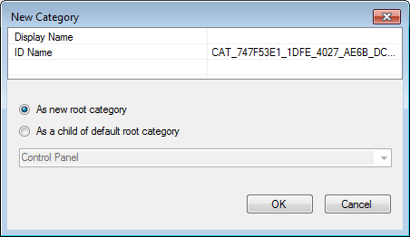
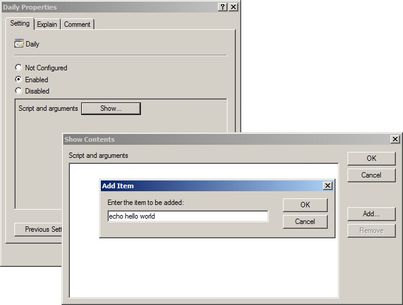

# Writing Group Policy Extensions

The chapter will explain how to write a Group Policy Extension for Samba's Winbind. Group Policy is a delivery mechanism for distributing system settings and company policies to machines joined to an Active Directory domain. Unix/Linux machines running Samba's Winbind can also deploy these policies.

## Creating the Server Side Extension {#sse}

### Administrative Templates {#admx}

The first step to deploying Group Policy is to create a Server Side Extension (SSE). There are multiple ways to create an SSE, but here we'll only discuss Administrative Templates (ADMX). The purpose of the SSE is to deploy policies to the SYSVOL share. Theoretically, you could manually deploy any file (even plain text) to the SYSVOL and then write a Client Side Extension that parses it, but ADMX can be read and modified by the Group Policy Management Editor, which makes administration of policies simpler.

ADMX files are simply XML files which explain to the Group Policy Management Console how to display and store a policy in the SYSVOL. AMDX files always store policies in Registry.pol files. Samba provides a mechanism for parsing these, which we'll discuss later.

Below is a simple example of an ADMX template, and it's corresponding ADML file.

**samba.admx:**

```xml
<policyDefinitions revision="1.0" schemaVersion="1.0">
  <policyNamespaces>
    <target prefix="fullarmor" namespace="FullArmor.Policies.98BB16AF_01EE_4D17_870D_A3311A44D6C2" />
    <using prefix="windows" namespace="Microsoft.Policies.Windows" />
  </policyNamespaces>
  <supersededAdm fileName="" />
  <resources minRequiredRevision="1.0" />
  <categories>
    <category name="CAT_3338C1DD_8A00_4273_8547_158D8B8C19E9" displayName="$(string.CAT_3338C1DD_8A00_4273_8547_158D8
B8C19E9)" />
    <category name="CAT_7D8D7DC8_5A9D_4BE1_8227_F09CDD5AFFC6" displayName="$(string.CAT_7D8D7DC8_5A9D_4BE1_8227_F09CD
D5AFFC6)">
      <parentCategory ref="CAT_3338C1DD_8A00_4273_8547_158D8B8C19E9" />
    </category>
  </categories>
  <policies>
    <policy name="POL_9320E11F_AC80_4A7D_A5C8_1C0F3F727061" class="Machine" displayName="$(string.POL_9320E11F_AC80_4A7D_A5C8_1C0F3F727061)" explainText="$(string.POL_9320E11F_AC80_4A7D_A5C8_1C0F3F727061_Help)" presentation="$(presentation.POL_9320E11F_AC80_4A7D_A5C8_1C0F3F727061)" key="Software\Policies\Samba\Unix Settings">
      <parentCategory ref="CAT_7D8D7DC8_5A9D_4BE1_8227_F09CDD5AFFC6" />
      <supportedOn ref="windows:SUPPORTED_WindowsVista" />
      <elements>
        <list id="LST_2E9A4684_3C0E_415B_8FD6_D4AF68BC8AC6" key="Software\Policies\Samba\Unix Settings\Daily Scripts" valueName="Daily Scripts" />
      </elements>
    </policy>
  </policies>
</policyDefinitions>
```

**en-US/samba.adml:**

```xml
<policyDefinitionResources revision="1.0" schemaVersion="1.0">
  <displayName>
  </displayName>
  <description>
  </description>
  <resources>
    <stringTable>
      <string id="CAT_3338C1DD_8A00_4273_8547_158D8B8C19E9">Samba</string>
      <string id="CAT_7D8D7DC8_5A9D_4BE1_8227_F09CDD5AFFC6">Unix Settings</string>
      <string id="POL_9320E11F_AC80_4A7D_A5C8_1C0F3F727061">Daily Scripts</string>
      <string id="POL_9320E11F_AC80_4A7D_A5C8_1C0F3F727061_Help">This policy setting allows you to execute commands, 
either local or on remote storage, daily.</string>
    </stringTable>
    <presentationTable>
      <presentation id="POL_9320E11F_AC80_4A7D_A5C8_1C0F3F727061">
        <listBox refId="LST_2E9A4684_3C0E_415B_8FD6_D4AF68BC8AC6">Script and arguments</listBox>
      </presentation>
    </presentationTable>
  </resources>
</policyDefinitionResources>
```

The meaning of the various tags are explained in Microsoft's Group Policy documentation at https://docs.microsoft.com/en-us/previous-versions/windows/desktop/policy/admx-schema. Before the endless documentation and confusing XML scares you away, be aware there is an easier way!

#### ADMX Migrator


FullArmor created the ADMX Migrator to simplify the shift for system administrators from the old ADM policy templates to ADMX. Fortunately, this tool also serves our purpose for assisting us in easily creating these templates for our SSE. Unfortunately, the tool hasn't seen any development in the past 8 years, and wont run in Windows 10 (or any Unix/Linux platform, for that matter). I had to dredge up a Windows 7 VM in order to install and use the tool.

##### Creating the Administrative Template

1. Open ADMX Migrator

2. Right click on ADMX Templates in the left tree view, and click New Template.

3. Give your template a name, and click OK.

4. Right click on the new template in the left tree view, and click New Category.



5. Give the Category a name. This name will be displayed in the Group Policy Management Editor under Administrative Templates. You can choose to nest template under an existing category, or simply add it as a new root.

::: {#info style="color: green;"}
Note: You can also add sub-categories under this category. After clicking OK, right click the category you created and select New Category.
:::

6. Next, create your policy by right clicking on your new category, and selecting New Policy Setting.


7. Because we'll be applying these settings to a Linux machine, the Registry fields are mostly meaningless, but they are required. Your policies will be stored under these keys on the SYSVOL in the Registry.pol file. Choose some sensible Registry Key, such as 'Software\Policies\Samba\Unix Settings', and a Registry Value Name, such as 'Daily Scripts' (these are the values used for Samba's cron.daily policy). The Display Name is the name that will be displayed for this policy in the Group Policy Management Editor. I usually make this the same as the Registry Value Name, but it doesn't need to be.

8. Select whether this policy will be applied to a Machine, a User, or to Both in the Class field. In our example, we could potentially set Both, then our Client Side Extension would need to handle both cron.daily scripts (the Machine) and also User crontab entries. Click OK for your policy to be created.

9. Your new policy will appear in the middle list view. Highlight it, and you will see a number of tabs below for configuring the policy.


10. Select the Values tab and set the Enabled Value Type. In this case, we'll use String, since our cron commands will be saved to the Registry.pol as a string. In the Value field, you can set a default enabled value (this is optional).

11. Select the Presentation tab, right click in the Elements view, and click New Element > ListBox (or a different presentation, depending on the policy). If you look at the samba.adml file from the previous section, you'll notice that the presentationTable contains a listBox item. That's what we're creating here.

12. Choose an element Label, this will be the name for the list displayed in the Group Policy Management Editor.

13. Choose a Registry Key. This will be pre-populated with the parent Registry Key you gave when creating the policy. Append something to the key to make it unique. We'll use 'Software\Policies\Samba\Unix Settings\Daily Scripts' for our cron.daily policy.

14. Navigate to the Explain tab, and add an explanation of what this policy is and what it does. This will be displayed to users in the Group Policy Management Editor.

15. Now right click on your template name in the left tree, and select Save As.

16. Finally, you'll need to deploy your new policy definition to the SYSVOL. It should be saved to the Policies\PolicyDefinitions (the Group Policy Central Store) directory. These instructions from Microsoft can assist you in setting up your Group Policy Central Store.



### samba-tool gpo manage

## Creating the Client Side Extension {#cse}
